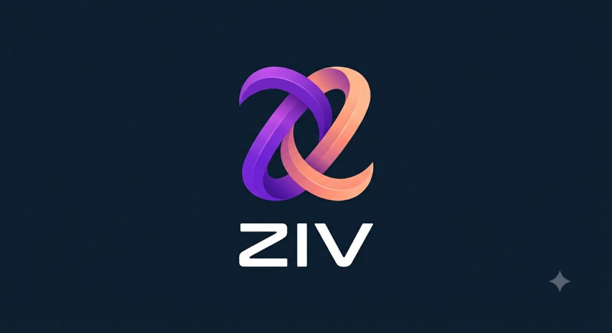
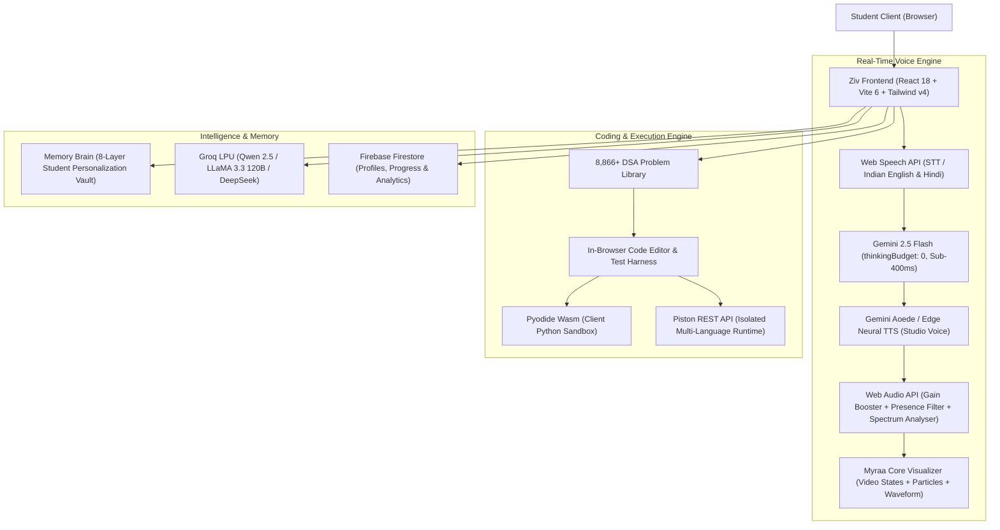

<div align="center">



# ⚡ Ziv — The Modern AI Engineering & Learning Playground
### *(Formerly DOAP — Discover Opportunities and Progress Platform)*
### *Next-Generation AI-Powered Engineering Mentorship, Holographic Real-Time Voice Intelligence & Career Acceleration Ecosystem*

<br />

[](https://ziv-1304.web.app)
[](https://github.com/thoratpratik2323-hue/doap-intelligent-learning/stargazers)
[](LICENSE)

<br />

[](https://react.dev/)
[](https://vitejs.dev/)
[](https://tailwindcss.com/)
[](https://ai.google.dev/)
[](https://ai.google.dev/)
[](https://pyodide.org/)
[](https://github.com/engineer-man/piston)
[](https://groq.com/)
[](https://firebase.google.com/)

<br />

[🚀 Explore Live Web App](https://ziv-1304.web.app) • [📦 GitHub Repository](https://github.com/thoratpratik2323-hue/doap-intelligent-learning) • [🐛 Report Bug / Feedback](https://github.com/thoratpratik2323-hue/doap-intelligent-learning/issues)

</div>

---

## 🏛️ Institutional Heritage & Dedication

**Ziv (DOAP Platform)** was conceptualized, architected, and engineered by **Pratik Thorat** for **Sanjivani College of Engineering (SCOE) / Sanjivani University, Kopargaon** (managed by **Sanjivani Rural Education Society — SRES**, founded in 1983 by visionary **Late Shri Shankarraoji Kolhe Saheb**).

The platform was built under the visionary educational patronship of:
* **Hon. Shri Nitindada S. Kolhe Saheb** — Chairman, Sanjivani Rural Education Society (SRES)
* **Hon. Shri Amitdada Kolhe Saheb** — Managing Trustee, Sanjivani Rural Education Society (SRES)

Created for the landmark **"Build Sanjivani's Own Large Language Model — AI for Sanjivani, by Sanjivani"** initiative on the occasion of the Birthday of **Hon. Shri Nitindada S. Kolhe Saheb**, Ziv represents an elite standard in academic artificial intelligence, real-time hands-free voice pedagogy, and software engineering career enablement.

---

## 🌟 What's New in v2.5 (Latest Updates)

### 🍒 1. Signature Cherry Red & Pure White UI Architecture
- **Complete Aesthetic Transformation**: Transitioned to a crisp, ultra-clean **Pure White (`#FFFFFF`)** background accented with vibrant **Cherry Red (`#E11D48` / `#BE123C`)** and delicate cherry blush surfaces (`#FFF1F2`).
- **Zero Faint Colors**: Replaced all washed-out light-blue/cyan tags with high-contrast deep Cherry Red badges (7:1+ AAA accessibility ratio).
- **Solid "Ask AI" Buttons**: Rebuilt problem-level AI guidance buttons into vivid cherry-crimson gradient pills with bold white typography.
- **Global High-Contrast CSS Shield**: Injected protective CSS overrides into `src/index.css` to guarantee razor-sharp contrast across every device.

### 🎙️ 2. Professor Myraa — Holographic AI Voice Tutor
- **Holographic Video Core**: Butter-smooth crossfading between 4 lifelike video postures:
  - `Idle`: Attentive, focused presence.
  - `Listening`: Active listening posture with animated ear-ring sound waves.
  - `Thinking`: Deep analytical contemplation pose.
  - `Talking`: Natural classroom teaching delivery and expressive speech articulation.
- **Sub-400ms Voice Response**: Configured `gemini-2.5-flash` with zero-overhead thinking budgets (`thinkingBudget: 0`) and 250 output tokens for instant conversational replies without mid-sentence truncations.
- **Live On-Screen Dialogue Subtitles**: Real-time subtitles display (`🎙️ You` & `👩‍🏫 Myraa`) directly above the control HUD so students can both listen and read simultaneously.
- **Strict Bilingual Language Matching**: Converses fluidly in English, Hindi, or natural Hinglish based on the student's spoken dialect.
- **Multi-Modal Vision & Screen Sharing**: Real-time frame capture allowing students to share homework, code snippets, or architecture diagrams for instant video review.

### 💻 3. 8,866+ DSA Problem Archive & In-Browser IDE
- **Comprehensive Problem Suites**: Curated challenges spanning Arrays, Trees, Dynamic Programming, Graphs, and System Design.
- **Top Tech Giant Placement Archives**: 16 dedicated company archives (Google, Microsoft, Amazon, TCS, Meta, Apple, Uber, Netflix, etc.).
- **Multi-Language Web IDE**: Instant in-browser code execution with automated test suites for JavaScript, Python 3, C++ (GCC), and Java.

---

## ✨ Key Highlights

```
 🍒 Cherry Red & White Palette │ 🎨 Crisp #FFFFFF canvas, #FFF1F2 blush cards & #E11D48 vivid accents
 🎙️ Professor Myraa Voice Core │ 👩‍🏫 Holographic AI Teacher with live audio waveforms & gesture crossfade
 ⚡ Sub-400ms Speech Response  │ ⚡ Gemini 2.5 Flash with thinkingBudget: 0 + Aoede Studio voice synthesis
 💬 Real-Time Live Subtitles   │ 📝 Instant on-screen display of student speech & Myraa's voice response
 💻 8,866+ Coding Challenges   │ 🏢 16 Company archives (TCS, Google, Amazon) + HackerRank & LeetCode
 🤖 1-Click "Ask AI" Guidance  │ 💡 Socratic intuition, time complexity proofs & edge-case breakdowns
 🎥 Proctored AI Interviewer   │ 👔 Instant fullscreen simulation, webcam proctoring HUD & hiring scorecards
 🏆 28 Certification Tracks    │ 📜 482+ verified assessment questions across Cloud, Security, Systems & AI
 💼 36 GitHub Take-Home Tasks  │ 🏗️ Real-world engineering assignments (Uber, Stripe, Datadog) + AI review
 🌐 Multi-Language Sandbox     │ ⚡ In-browser execution for JS, Python (Pyodide Wasm), C++ & Java (Piston)
```

---

## 🏛️ System Architecture



---

## 📂 Project Structure

```
doap-app-main/
├── public/
│   ├── assets/
│   │   ├── idle.mp4                # Myraa Idle character video
│   │   ├── listening.mp4           # Myraa Attentive listening video
│   │   ├── thinking.mp4            # Myraa Contemplation video
│   │   ├── talking.mp4             # Myraa Active teaching delivery video
│   │   └── myraa_intro.mp3         # Pre-rendered zero-delay welcome audio
│   ├── ziv-logo.png                # Official Ziv platform insignia
│   └── doap-logo.jpg               # Institutional emblem
├── src/
│   ├── components/
│   │   ├── Myraa/
│   │   │   ├── MyraaCoreVisualizer.jsx # Holographic video player & audio spectrum
│   │   │   ├── MemoryDashboard.jsx     # Student memory & preferences inspector
│   │   │   └── SettingsPanel.jsx       # Voice, sensitivity & engine settings
│   │   ├── Shell/
│   │   │   ├── Header.jsx              # Top app bar (Pure White & Cherry Red)
│   │   │   └── Sidebar.jsx             # Left navigation with Ziv branding
│   │   └── Interview/                  # AI-proctored mock interview components
│   ├── context/
│   │   ├── ThemeContext.jsx            # Dynamic Cherry Red & White theme provider
│   │   └── AuthContext.jsx             # Firebase student authentication
│   ├── data/
│   │   ├── gradientThemes.js           # Centralized color schemes & tokens
│   │   └── dsa/                        # 8,866+ DSA problems & company archives
│   ├── lib/
│   │   ├── myraaAudio.js               # Web audio session, STT, Gemini Flash & TTS
│   │   ├── myraaMemory.js              # Local & cloud memory persistence
│   │   └── myraaTypes.js               # Types, color themes & engine defaults
│   ├── pages/
│   │   ├── VoiceTutor.jsx              # Professor Myraa Holographic Voice Classroom
│   │   ├── CodingPractice.jsx          # DSA IDE, test runner & "Ask AI" tutor
│   │   ├── AITutor.jsx                 # Text-based conversational AI mentor
│   │   ├── AIInterview.jsx             # Fullscreen proctored video interview suite
│   │   ├── Assessments.jsx             # 28 Technical certification tracks
│   │   └── JobReadiness.jsx            # Resume ATS optimizer & career pipeline
│   ├── services/
│   │   ├── elevenLabsService.js        # High-fidelity Aoede & Neural TTS engine
│   │   ├── aiTutorEngine.js            # Pedagogical Socratic inference engine
│   │   └── memoryBrain.js              # Long-term conversational learning engine
│   └── index.css                       # Global styles & high-contrast accessibility rules
└── server/                             # Node.js backend proxy & fallback TTS services
```

---

## 🚀 Quickstart & Local Setup

### Prerequisites
- Node.js (v18.0 or higher)
- npm or yarn

### 1. Clone the Repository
```bash
git clone https://github.com/thoratpratik2323-hue/doap-intelligent-learning.git
cd doap-intelligent-learning
```

### 2. Install Dependencies
```bash
npm install
```

### 3. Configure Environment Variables
Create a `.env` file in the root directory:
```env
VITE_GEMINI_API_KEY=your_google_gemini_api_key
GEMINI_API_KEY=your_google_gemini_api_key
```

### 4. Run Development Server
```bash
npm run dev
```
Open [http://localhost:5173](http://localhost:5173) in your browser to experience Ziv locally!

### 5. Production Build
```bash
npm run build
```

---

## 📦 Production Deployment

The production application is continuously deployed on **Firebase Hosting**:
```bash
# Login to Firebase
firebase login

# Deploy hosting assets
firebase deploy --only hosting
```
Live URL: **[https://ziv-1304.web.app](https://ziv-1304.web.app)**

---

## 🛠️ Tech Stack

- **Frontend Core**: React 18, Vite 6, Tailwind CSS v4, Lucide Icons, Canvas API, Web Audio API
- **AI & Real-Time Voice**: Google Gemini 2.5 Flash, Gemini Aoede Voice, Edge Neural TTS, Web Speech Recognition
- **Code Execution**: Pyodide Wasm (Python in-browser), Piston API (Multi-language sandbox)
- **State & Backend**: Firebase Authentication, Firestore Database, Firebase Hosting
- **Design System**: Tailored **Pure White & Cherry Red** with 7:1+ contrast ratios and soft blush layers

---

## 📄 License & Attribution

Distributed under the **MIT License**.

Engineered with ❤️ for the students and faculty of **Sanjivani College of Engineering / Sanjivani University** by **Pratik Thorat**.
