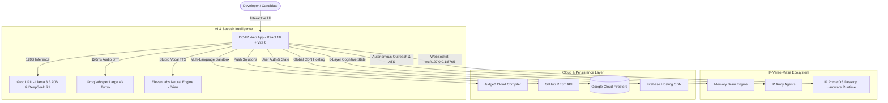

<div align="center">


# ⚡ DOAP — Discover Opportunities and Progress Platform
### *The Next-Generation AI-Powered Engineering Mentorship, Real-Time Voice Intelligence & Career Acceleration Ecosystem*

<br />

[](https://doap-1908.web.app)
[](https://github.com/thoratpratik2323-hue/doap-intelligent-learning/stargazers)
[](LICENSE)

<br />

[](https://react.dev/)
[](https://vitejs.dev/)
[](https://tailwindcss.com/)
[](https://groq.com/)
[](https://groq.com/)
[](https://elevenlabs.io/)
[](https://firebase.google.com/)

<br />

[Explore Live Web App 🚀](https://doap-1908.web.app) • [GitHub Repository 📦](https://github.com/thoratpratik2323-hue/doap-intelligent-learning) • [Report Bug 🐛](https://github.com/thoratpratik2323-hue/doap-intelligent-learning/issues)

</div>

---

## 🏛️ Institutional Heritage & Background

**DOAP (Discover Opportunities and Progress Platform)** was conceptualized and developed by **Pratik Thorat** for **Sanjivani College of Engineering (SCOE) / Sanjivani University, Kopargaon** (managed by Sanjivani Rural Education Society - SRES, founded in 1983 by Late Shri Shankarraoji Kolhe Saheb).

The platform was built under the visionary educational leadership of:
* **Hon. Shri Nitindada S. Kolhe Saheb** — Chairman, Sanjivani Rural Education Society (SRES)
* **Hon. Shri Amitdada Kolhe Saheb** — Managing Trustee, Sanjivani Rural Education Society (SRES)

Created for the landmark **"Build Sanjivani's Own Large Language Model — Build AI for Sanjivani, by Sanjivani"** initiative on the occasion of the Birthday of Hon. Shri Nitindada S. Kolhe Saheb, DOAP represents an elite leap in academic AI, hands-free conversational intelligence, and software engineering mentorship.

---

## 📖 Table of Contents
- [✨ Key Highlights](#-key-highlights)
- [🧠 Cognitive Self-Thinking Super-Brain](#-cognitive-self-thinking-super-brain)
- [🎙️ Real-Time Voice AI Tutor (Mark-LII Engine)](#️-real-time-voice-ai-tutor-mark-lii-engine)
- [🧬 Unified 8-Layer Living Memory Brain](#-unified-8-layer-living-memory-brain)
- [📱 Dual-Mode "Ask DOAP" Quick Launcher](#-dual-mode-ask-doap-quick-launcher)
- [🎥 AI Video Mock Interviewer & Telemetry](#-ai-video-mock-interviewer--telemetry)
- [💻 Multi-Language Code Sandbox](#-multi-language-code-sandbox)
- [📄 1-Click Harvard ATS PDF Resume Studio](#-1-click-harvard-ats-pdf-resume-studio)
- [🏛️ System Architecture](#️-system-architecture)
- [📂 Project Structure](#-project-structure)
- [🚀 Quickstart & Installation](#-quickstart--installation)
- [🛠️ Tech Stack](#️-tech-stack)
- [📄 License](#-license)

---

## ✨ Key Highlights

```
 🧠 Groq 120B Super-Brain     │ ⚡ Sub-150ms Inference (GPT-OSS 120B Flagship & Qwen 27B)
 🔬 Deep Self-Thinking        │ 🧩 DeepSeek-R1 / o1 Style <think> Chain-of-Thought Reflection
 🎙️ Studio Voice AI           │ 🔊 ElevenLabs Charon Turbo (Zero Drift, Sub-Second Latency)
 🧬 Unified 8-Layer Brain     │ 🗄️ Continuous Self-Learning Across Voice & Text Modes
 📱 Dual-Mode Quick Launcher  │ 🚀 "Ask DOAP" 1-Click Selector for Text Tutor or Voice Tutor
 📝 In-Chat Flash Quizzes     │ 💡 Interactive MCQs with Hidden Explanations (/quiz)
 🎨 Flux AI Art Generator     │ 🖼️ Live Neural Artwork Generation in Chat (/image)
 💻 Multi-Language Sandbox    │ ⚡ Browser Execution for Python, C++, Java & JavaScript
 🎥 AI Video Mock Interviewer │ 👔 Principal AI Lead Avatar + 3-Day Recovery Curriculum
 📄 1-Click ATS Resume Studio │ 📥 Harvard Vector PDF Export (100/100 ATS Pass Rate)
 ☁️ Multi-Device Cloud Sync   │ 🔄 Real-time Firestore Persistence & Multi-CDN Hosting
```

---

## 🧠 Cognitive Self-Thinking Super-Brain (`/ai-tutor`)

### 1. Metacognitive Reasoning Engine
Inspired by modern reasoning models (**DeepSeek-R1**, **OpenAI o1**, **Claude 3.7 Sonnet**), DOAP performs explicit chain-of-thought self-reflection before providing solutions for complex engineering problems:
* **Constraint & Invariant Formulation**: Identifies inputs, outputs, edge cases, and $O(N)$ time/space complexity bounds.
* **Alternative Strategy Comparison**: Weighs brute force vs. hash maps, two pointers vs. sliding windows, iterative vs. dynamic programming.
* **Trap & Edge-Case Verification**: Checks off-by-one errors, null pointers, empty data structures, and integer overflow.
* **Step-by-Step Logic Proof**: Verifies that the approach satisfies all constraints before synthesizing the final answer.

### 2. Collapsible Reasoning UI (`MarkdownRenderer.jsx`)
* Renders a glowing **"🧠 DOAP Deep Cognitive Thinking & Self-Reflection"** accordion card right above the solution.
* Features a dynamic **"Verified"** / **"Thinking in progress..."** status badge with a one-click toggle to view the full monospace reasoning trace.

### 3. In-Chat Interactive Flash Quizzes (`/quiz [py|c|java|dsa]`)
* Interactive technical multiple-choice question cards embedded directly in the chat stream.
* Answers and explanations are **hidden by default** inside collapsible blocks, allowing students to test their intuition before revealing the solution.

### 4. Flux AI Image Generation (`/image <prompt>`)
* Generates high-resolution, photorealistic neural artwork on-demand directly inside the chat interface via Flux Neural Engine.

### 5. Strict Multilingual Mirroring
* Automatically detects the user's language and dialect (English, Hinglish, pure Hindi in Devanagari script, Marathi) and responds 1:1 in the exact same conversational tone.

---

## 🎙️ Real-Time Voice AI Tutor (Mark-LII Engine) (`/voice-tutor`)

### 1. Studio-Grade Charon Voice Core (`elevenLabsService.js`)
* **Voice Model**: Powered by **ElevenLabs Charon (`pNInz6obpgDQGcFmaJgB`)** using the high-efficiency `eleven_turbo_v2_5` pipeline.
* **Tuned Acoustic Settings**: High stability (0.50) and style (0.0) configuration eliminates mid-speech voice drift and keeps the vocal pitch warm, resonant, and authoritative.
* **Phonetic Normalization**: Specially tuned for Indian English and technical vocabulary (*"D-S-A"*, *"D-B-M-S"*, *"Kopar-gaon"*, *"Sanjeevani"*, *"Nitin-dada"*).

### 2. Sub-Second Zero-Latency Pipeline
* **Instant Speech-First Priority**: Voice synthesis begins immediately on the first breath.
* **Clean 1–2 Sentence Spoken Cadence**: Compact, verified answers designed specifically for conversational listening without overwhelming technical monologues.
* **Pure Living Orb UI**: Completely removes distracting chat cards for an immersive, distraction-free holographic Mark-LII Arc-Reactor experience that pulses to speech volume.
* **Acoustic Guard**: 400ms silence detection and dynamic echo prevention to avoid mic feedback loops.

---

## 🧬 Unified 8-Layer Living Memory Brain (`memoryBrain.js`)

Unlike standard chatbots where conversation history is lost upon page refresh, DOAP features an **autonomous 8-layer cognitive memory graph**:

```
┌────────────────────────────────────────────────────────────────────────┐
│                   DOAP 8-LAYER UNIFIED MEMORY GRAPH                   │
├────────────────────────────────────────────────────────────────────────┤
│ Layer 1: Identity & Persona     │ Developer goals, targets (Google, OpenAI)
│ Layer 2: Episodic Memory        │ Chronological history of past topics & turns
│ Layer 3: Semantic Knowledge     │ Mastered skills vs. in-progress topics
│ Layer 4: Weakness Tracker       │ Stumbling points queued for review
│ Layer 5: Procedural Preferences │ Preferred coding language, theme, cadence
│ Layer 6: Project Registry       │ Known projects (IP-Verse-Mafia, DOAP)
│ Layer 7: Career Milestones      │ Solved problem count, ATS readiness score
│ Layer 8: Synthesized Working Mem│ Active context injected into every prompt
└────────────────────────────────────────────────────────────────────────┘
```

### Continuous Autonomous Self-Learning (`learnFromInteraction`)
* **Mastery Signal Detection**: Keywords like *"understood"*, *"solved it"*, *"samajh gaya"*, *"ban gaya"* automatically move concepts to `semantic.mastered`, increment problem counts, and boost readiness scores.
* **Friction & Weakness Detection**: Keywords like *"stuck"*, *"bug"*, *"confused"*, *"error"* automatically flag concepts in `weaknesses.reviewTopics` for proactive coaching.
* **Cross-AI Synchronization**: What you discuss in Voice AI is **immediately remembered by Text AI**, and what you solve in Text AI is **instantly known to Voice AI**!

---

## 📱 Dual-Mode "Ask DOAP" Quick Launcher

Clicking **"Ask DOAP"** on the Home dashboard opens an interactive glassmorphic modal allowing users to choose their optimal learning path:
1. 💬 **Text AI Tutor**: Deep Cognitive Self-Thinking, interactive chat, code generation, quizzes, and Flux AI generation.
2. 🎙️ **Voice AI Tutor**: Hands-free conversational audio call with ElevenLabs Charon studio voice and live Arc-Reactor HUD.

### 3. Local Hardware Runtime Connector (`src/services/localSystemConnector.js`)
* Real-time bidirectional WebSocket bridge to `ws://127.0.0.1:8765` (IP Prime OS `room_server.py`).
* Enables 0ms native Python, C++, and Java execution directly on local Windows hardware with automatic fallback to cloud Judge0.

---

## 💻 Multi-Language Code Sandbox (`/coding`)

* **Multi-Language Support:** JavaScript, Python 3, C++ (GCC), and Java.
* **Instant In-Browser Test Runner:** Client-side sandboxed execution with automated assertion checks, runtime benchmarking, and error diagnostics.
* **1-Click GitHub Integration:** Direct solution push to GitHub repositories via personal access tokens (`githubService.js`).

---

## 🏛️ System Architecture



---

## 📂 Project Structure

```
doap-intelligent-learning/
├── 📁 public/                     # Static assets, logos, and manifest
├── 📁 src/
│   ├── 📁 components/             # Reusable UI modules
│   │   ├── 📁 Auth/               # Login & Registration authentication screens
│   │   ├── 📁 Common/             # ErrorBoundaries, Buttons, WeakAreasAnalyzer
│   │   ├── 📁 Interview/          # AI Avatar, Telemetry HUD, Workspace & Reports
│   │   │   ├── AIInterviewerAvatar.jsx    # Holographic AI Lead speech avatar
│   │   │   ├── InterviewTelemetryHUD.jsx  # Real-time filler word & WPM meter
│   │   │   ├── LiveInterviewWorkspace.jsx # Proctored dual-stream workspace
│   │   │   └── InterviewReport.jsx        # Executive hiring report card
│   │   ├── 📁 JobReadiness/       # Career suite & resume tools
│   │   │   ├── ATSResumePreview.jsx       # 1-Click Harvard ATS PDF generator
│   │   │   └── IPArmySuite.jsx            # LinkedIn Agent & Resume Builder
│   │   ├── 📁 Landing/            # Public marketing landing page
│   │   ├── 📁 Modals/             # Profile, Settings, Auth dialogs
│   │   ├── 📁 Shell/              # Header, Sidebar, AmbientBackground
│   │   └── MarkdownRenderer.jsx   # Syntax-highlighted code formatter
│   ├── 📁 context/                # AuthContext (Firestore sync) & ThemeContext
│   ├── 📁 data/                   # Interview question banks, DSA problems, positions
│   ├── 📁 hooks/                  # Camera, FaceDetection, Proctoring, SpeechRecognition
│   ├── 📁 lib/                    # Firebase client initialization
│   ├── 📁 pages/                  # Main application views
│   │   ├── AITutor.jsx            # 120B Chat mentor with quiz & image generator
│   │   ├── VoiceTutor.jsx         # Hands-free Voice AI with Arc Reactor visualizer
│   │   ├── AIInterview.jsx        # Interactive video mock interview simulator
│   │   ├── CodingPractice.jsx     # Multi-language sandbox with IP Codemaker
│   │   ├── JobReadiness.jsx       # Career suite & ATS resume generator
│   │   ├── Assessments.jsx        # Benchmark quizzes & technical exams
│   │   ├── Dashboard.jsx          # Real-time telemetry, readiness radar, streak
│   │   ├── MyLearning.jsx         # Curriculum tracking
│   │   └── StudyPlan.jsx          # Live calendar & AI scheduler
│   ├── 📁 services/               # Core service layer
│   │   ├── aiTutorEngine.js       # Groq 120B Super-Brain & language mirroring
│   │   ├── elevenLabsService.js   # ElevenLabs studio voice engine
│   │   ├── whisperService.js      # Groq Whisper Large v3 STT
│   │   ├── ipArmyAgents.js        # LinkedIn, Resume & Codemaker autonomous agents
│   │   ├── memoryBrain.js         # 8-Layer Unified Cognitive Memory
│   │   ├── localSystemConnector.js# IP Prime OS WebSocket runtime connector
│   │   └── githubService.js       # GitHub solution committer
│   ├── App.jsx                    # Root router with ErrorBoundary
│   ├── index.css                  # Design system tokens & print styles
│   └── main.jsx                   # React DOM entry point
├── firestore.rules                # Granular Firestore security policies
├── firebase.json                  # Firebase Hosting routing & CSP configuration
├── package.json                   # Project dependencies & scripts
└── vite.config.js                 # Vite bundling & asset chunking config
```

---

## 🚀 Quickstart & Installation

### 1️⃣ Clone the Repository
```bash
git clone https://github.com/thoratpratik2323-hue/doap-intelligent-learning.git
cd doap-intelligent-learning
```

### 2️⃣ Install Dependencies
```bash
npm install
```

### 3️⃣ Configure Environment Variables
Create a `.env` file in the root directory:
```env
# Groq LPU 120B Super-Brain & Whisper STT
VITE_GROQ_API_KEY=your_groq_api_key_here

# ElevenLabs Neural Voice Synthesis
VITE_ELEVENLABS_API_KEY=your_elevenlabs_api_key_here

# RapidAPI Judge0 Key (Multi-language sandbox)
VITE_RAPIDAPI_KEY=your_rapidapi_key_here

# Firebase Configuration
VITE_FIREBASE_API_KEY=your_firebase_api_key
VITE_FIREBASE_AUTH_DOMAIN=doap-1908.firebaseapp.com
VITE_FIREBASE_PROJECT_ID=doap-1908
VITE_FIREBASE_STORAGE_BUCKET=doap-1908.firebasestorage.app
VITE_FIREBASE_MESSAGING_SENDER_ID=619777181269
VITE_FIREBASE_APP_ID=1:619777181269:web:a54bcb279a3bfe17bb36dc
```

### 4️⃣ Launch Development Server
```bash
npm run dev
```
Open **[http://localhost:5173](http://localhost:5173)** in your browser.

---

## 📦 Production Deployment

To build and deploy to Firebase Hosting:

```bash
# Build optimized production bundle
npm run build

# Deploy to Firebase Hosting CDN
npx firebase deploy --only hosting
```

---

## 🔐 Security & Content Policies

* **Granular Firestore Security:** User documents (`users/{userId}`) are isolated by strict security rules requiring authentic Firebase UID ownership.
* **Content Security Policy (CSP):** Configured in `firebase.json` to allow secured WebSocket bridging (`ws://127.0.0.1:*`, `ws://localhost:*`) for desktop runtime execution without compromising safety.
* **Zero Leakage:** All API keys are loaded safely from environment variables and protected against client-side exposure.

---

## 🛠️ Tech Stack

| Domain | Technologies |
|---|---|
| **Frontend Framework** | React 18, Vite 6 |
| **Styling & UI Design** | Tailwind CSS v4, Lucide Icons, Glassmorphism & Print Media Engine |
| **Large Language Models** | Groq LPU (GPT-OSS 120B Flagship, Qwen 27B) + Deep Cognitive Self-Thinking |
| **Speech & Audio** | Groq Whisper Large v3 Turbo, ElevenLabs Charon Studio Voice Core (`eleven_turbo_v2_5`) |
| **Cognitive Memory** | Unified 8-Layer Living Memory Brain (`memoryBrain.js`) with continuous self-learning |
| **Image Generation** | Flux Neural Engine via Pollinations |
| **Data Visualizations** | Recharts (Radar charts, Line graphs, Telemetry gauges) |
| **Database & Auth** | Google Cloud Firestore, Firebase Authentication |
| **Code Execution** | Local IP Prime OS WebSocket Runtime, Judge0 Cloud API |
| **Hosting Infrastructure** | Firebase Global Multi-CDN Hosting (`https://doap-1908.web.app`) |

---

## 🤝 Contributing

Contributions are welcomed! Feel free to submit issues or pull requests:

1. Fork the Project
2. Create your Feature Branch (`git checkout -b feature/NewFeature`)
3. Commit your Changes (`git commit -m 'feat: Add NewFeature'`)
4. Push to the Branch (`git push origin feature/NewFeature`)
5. Open a Pull Request

---

## 📄 License

Distributed under the **MIT License**. See `LICENSE` for more information.

---

<div align="center">

Crafted with ❤️ for **Sanjivani University (SCOE), Kopargaon** by **[Pratik Thorat](https://github.com/thoratpratik2323-hue)**

⭐ **If you find this project inspiring, please star the repository!** ⭐

</div>
