<div align="center">


# ⚡ DOAP — Discover Opportunities and Progress Platform
### *The Next-Generation AI-Powered Engineering Mentorship, Real-Time Voice Intelligence & Career Acceleration Ecosystem*

<br />

[](https://doap-1908.web.app)
[](https://github.com/thoratpratik2323-hue/doap-intelligent-learning/stargazers)
[](LICENSE)

<br />

[](https://react.dev/)
[](https://vitejs.dev/)
[](https://tailwindcss.com/)
[](https://groq.com/)
[](https://groq.com/)
[](https://elevenlabs.io/)
[](https://firebase.google.com/)

<br />

[Explore Live Web App 🚀](https://doap-1908.web.app) • [GitHub Repository 📦](https://github.com/thoratpratik2323-hue/doap-intelligent-learning) • [Report Bug 🐛](https://github.com/thoratpratik2323-hue/doap-intelligent-learning/issues)

</div>

---

## 🏛️ Institutional Heritage & Background

**DOAP (Discover Opportunities and Progress Platform)** was conceptualized and developed by **Pratik Thorat** for **Sanjivani College of Engineering (SCOE) / Sanjivani University, Kopargaon** (managed by Sanjivani Rural Education Society - SRES, founded in 1983 by Late Shri Shankarraoji Kolhe Saheb).

The platform was built under the visionary educational leadership of:
* **Hon. Shri Nitindada S. Kolhe Saheb** — Chairman, Sanjivani Rural Education Society (SRES)
* **Hon. Shri Amitdada Kolhe Saheb** — Managing Trustee, Sanjivani Rural Education Society (SRES)

Created for the landmark **"Build Sanjivani's Own Large Language Model — Build AI for Sanjivani, by Sanjivani"** initiative on the occasion of the Birthday of Hon. Shri Nitindada S. Kolhe Saheb, DOAP represents an elite leap in academic AI, hands-free conversational intelligence, and software engineering mentorship.

---

## 📖 Table of Contents
- [✨ Key Highlights](#-key-highlights)
- [🏛️ Sanjivani LLM Studio (Unsloth, vLLM & Ollama)](#️-sanjivani-llm-studio-unsloth-vllm--ollama)
- [⚡ Open-Source Runtimes: Pyodide Wasm, Kokoro TTS & Piston](#-open-source-runtimes-pyodide-wasm-kokoro-tts--piston)
- [🟩 HackerRank Interview Preparation Kit & Placement Suite](#-hackerrank-interview-preparation-kit--placement-suite)
- [🧠 Brain Vault (Visual 8-Layer Memory Inspector)](#-brain-vault-visual-8-layer-memory-inspector)
- [🎙️ Real-Time Voice AI Tutor with Live I/O Console (`IO`)](#️-real-time-voice-ai-tutor-with-live-io-console-io)
- [📱 Mobile Speech STT & Floating Widgets Stability](#-mobile-speech-stt--floating-widgets-stability)
- [🛡️ Proctored Fullscreen Coding Assessment & Proficiency Engine](#️-proctored-fullscreen-coding-assessment--proficiency-engine)
- [🧠 Cognitive Self-Thinking Super-Brain (`/ai-tutor`)](#-cognitive-self-thinking-super-brain-ai-tutor)
- [🎯 Job Description (JD) ATS Matcher & Resume Optimizer](#-job-description-jd-ats-matcher--resume-optimizer)
- [🔥 Daily DOAP Streak & Challenge Drill Engine](#-daily-doap-streak--challenge-drill-engine)
- [📱 Dual-Mode "Ask DOAP" Quick Launcher](#-dual-mode-ask-doap-quick-launcher)
- [🎥 AI Video Mock Interviewer & Telemetry](#-ai-video-mock-interviewer--telemetry)
- [📄 1-Click Harvard ATS PDF Resume Studio](#-1-click-harvard-ats-pdf-resume-studio)
- [🏛️ System Architecture](#️-system-architecture)
- [📂 Project Structure](#-project-structure)
- [🚀 Quickstart & Installation](#-quickstart--installation)
- [🛠️ Tech Stack](#️-tech-stack)
- [📄 License](#-license)

---

## ✨ Key Highlights

```
 🧠 DOAP Thinking 120B Brain  │ ⚡ Deep Cognitive Self-Thinking & Sub-150ms Groq LPU Inference
 🟩 HackerRank Placement Track│ 🎯 20 Iconic Interview Prep Kit & Problem Solving Cert Challenges
 🌐 Multi-Platform Filtering  │ 🔍 1-Click Switch: All (167+), HackerRank, LeetCode & Blind 75
 📜 HackerRank Cert Mock Exam │ ⏱️ Timed Problem Solving Assessment in /assessments
 🎙️ Studio Voice AI + Live IO │ 🔊 ElevenLabs Charon Turbo + Groq Whisper + Mobile STT Fallback
 🧠 Visual Brain Vault (8L)   │ 🔍 Interactive Knowledge Graph, Friction Points & Context Engine
 🛡️ Proctored Fullscreen Exam │ 🔒 Strict Native Fullscreen, Anti-Cheat Tab Lock & Violation Blocker
 📊 Student Proficiency Score │ 🎓 0-100 Verified Metric (Correctness, Speed, Autonomy & Integrity)
 📌 Top-Mounted Problem Card  │ 📋 Prominent Statements, Benchmarks, Constraints & Examples on Top
 ❌ Strict Automated Tests    │ 🚫 Manual "Mark as Solved" Removed (Pass Tests to Solve)
 🎯 JD ATS Matcher & Tailor   │ 💼 Real Company Match Score (Google, Amazon, TCS) + XYZ Bullet Writer
 🔥 Daily DOAP Streak Engine  │ 📅 Interactive Daily Problem Drills, Week Badges & Local Persistence
 💻 Multi-Language Sandbox    │ ⚡ In-Browser Execution for JavaScript, Python 3, C++ (GCC) & Java
 🎥 AI Video Mock Interviewer │ 👔 Principal AI Lead Avatar + Real-Time Telemetry HUD & Report Card
 📄 Harvard ATS Resume Studio │ 📥 1-Click Vector PDF Export (100/100 ATS Pass Rate)
 ☁️ Multi-Device Cloud Sync   │ 🔄 Real-Time Firestore Persistence & Fast Multi-CDN Hosting
```

## 🏛️ Sanjivani LLM Studio (Unsloth, vLLM & Ollama)

The dedicated [`sanjivani-llm/`](file:///sanjivani-llm/) directory provides a turnkey, university-grade training, fine-tuning, and inference suite designed for **Sanjivani College of Engineering / Sanjivani University**:

* **\`dataset_curator.py\`**:
  * Extracts algorithmic challenges and reasoning chains from DOAP's curated repository.
  * Formats instruction-tuning datasets with DeepSeek-R1 / Open-Thoughts style `<think> ... </think>` CoT reasoning traces.
* **\`train_unsloth_sanjivani.py\`**:
  * Powered by **Unsloth** for **2x–5x faster training with 70% less VRAM**.
  * Pre-configured with 4-bit QLoRA, gradient checkpointing, and ChatML templating targeting `Qwen2.5-Coder-7B-Instruct` or `Llama-3.1-8B-Instruct`.
  * Fully executable on a single free Google Colab GPU (T4 / V100 / A100) or campus workstation.
  * Exports 16-bit merged weights and 4-bit quantized GGUF checkpoints automatically.
* **1-Click Local & Campus Serving**:
  * **vLLM (`serve_vllm.sh`)**: High-throughput OpenAI-compatible API serving on campus infrastructure (`http://0.0.0.0:8000/v1`).
  * **Ollama (`Modelfile`)**: 1-click quantized local CPU/GPU serving on student laptops (`ollama create sanjivani-coder -f Modelfile`).

---

## ⚡ Open-Source Runtimes: Pyodide Wasm, Kokoro TTS & Piston

DOAP eliminates third-party subscription limits and API bottlenecks through native open-source runtimes:

* **🐍 In-Browser Python 3 WebAssembly Runtime ([`src/services/pyodideRunner.js`](file:///src/services/pyodideRunner.js))**:
  * Powered by **Pyodide WebAssembly (Wasm)**.
  * Executes student Python 3 code directly inside the browser with **0ms network latency and zero server API costs**.
  * Isolates executions, captures stdout, formats test outputs, and automatically falls back to compiler APIs or AI neural simulation if offline.
* **🎙️ Open-Weights Kokoro TTS Voice Engine**:
  * Integrated directly into [`src/services/elevenLabsService.js`](file:///src/services/elevenLabsService.js) and the Settings Modal.
  * Supports local OpenAI-compatible endpoints (`http://localhost:8880/v1/audio/speech`) running the 82M parameter **Kokoro TTS** model for lightning-fast, offline voice synthesis.
* **🐳 Self-Hosted Multi-Language Sandbox ([`docker-compose.piston.yml`](file:///docker-compose.piston.yml))**:
  * Pre-configured Docker Compose specification for **Engineer-man Piston**.
  * Executes Python, C++, Java, Node.js, Rust, and Go in secure, disposable containers.

---

## 🟩 HackerRank Interview Preparation Kit & Placement Suite

DOAP now natively integrates **20 of the most iconic, high-yield challenges** from HackerRank's acclaimed **Interview Preparation Kit** and **Problem Solving Certification** curricula ([`src/data/dsa/hackerRankProblems.js`](file:///src/data/dsa/hackerRankProblems.js)):

* **Platform Filter Pill Selector**:
  * 🌐 **All Platforms**: Comprehensive access to all 167+ interactive challenges.
  * 🟩 **HackerRank**: 20 specialized challenges mapped directly to tech campus placements and certification tests.
  * 🟧 **LeetCode**: 147 classic algorithmic challenges across all 15 DSA domains.
  * 🔥 **Blind 75**: Curated essential 75 high-frequency problems.
* **Featured HackerRank Challenges**:
  * *Sales by Match (Sock Merchant)* — O(N) Hash Map frequency pairing.
  * *Counting Valleys* — Sea-level simulation & invariant tracking.
  * *Jumping on the Clouds* & *Repeated String* — Greedy & modular arithmetic.
  * *2D Array - DS (Hourglass Sum)* & *Left Rotation* — Matrix & cyclic array manipulations.
  * *New Year Chaos* & *Minimum Swaps 2* — Permutations & cycle detection.
  * *Two Strings*, *Ransom Note* & *Sherlock and Anagrams* — String canonical hashing & frequency maps.
  * *Balanced Brackets* — LIFO stack evaluation.
  * *Max Array Sum* & *Common Child* — Non-adjacent DP & Longest Common Subsequence (LCS).
  * *Binary Tree Height* & *BST Lowest Common Ancestor (LCA)* — Tree traversals.
* **Automated Multi-Language In-Browser Testing**:
  * Instant starter templates in **JavaScript (ES6)**, **Python 3**, **C++ (GCC)**, and **Java**.
  * Isolated Web Worker test execution with hard 3.0s timeout and self-healing DOAP AI Neural Code Simulation Engine.
* **HackerRank Problem Solving Certification Mock (`/assessments`)**:
  * Dedicated 6-question timed mock assessment testing core algorithmic principles, DP state transitions, and complexity invariants required to pass HackerRank's official skill certification tests.

---

## 📱 Mobile Speech STT & Floating Widgets Stability

* **Cross-Browser Mobile Speech Fallback**:
  * [`src/hooks/useSpeechRecognition.js`](file:///src/hooks/useSpeechRecognition.js) automatically pairs the Web Speech API with a resilient Web Audio API `MediaRecorder` pipeline.
  * Seamlessly falls back to Groq Whisper Large v3 Turbo transcription when mobile browsers (such as Android Chrome or iOS Safari) restrict native speech recognition.
* **Dismissible Assessment Gateway**:
  * Fixed backdrop click and `ESC` key handlers on coding assessment modals so users can freely cancel or exit dialogs without being locked in.
* **Responsive Fixed Floating Widgets**:
  * Standardized z-index layers (`z-40` to `z-50`) across Pomodoro Break Timers, Floating Audio HUDs, and Bottom Drawers, preventing overlap and clipping on mobile viewports.

---

## 🧠 Brain Vault (Visual 8-Layer Memory Inspector)

Mounted globally via [`src/components/Modals/BrainVaultModal.jsx`](file:///src/components/Modals/BrainVaultModal.jsx) with a glowing navigation item in the Sidebar, the **Brain Vault** allows students to visually inspect and interact with the AI's living memory state in real-time:

* **Layer 3 & 4 (Interactive Knowledge Graph)**:
  * **Mastered Skills**: Visual emerald badges celebrating concepts conquered through assessment.
  * **In-Progress Skills**: Cyan badges tracking active learning trajectories.
  * **Friction Points & Weaknesses**: Rose badges highlighting algorithmic traps with a 1-click **"Practice with AI"** button and quick deletion.
  * **Custom Node Injection**: Add custom skills or focus areas on the fly.
* **Layer 2 (Chronological Episodic Timeline)**:
  * View recent AI learning milestones and timestamps (`10m ago`, `1h ago`).
* **Layer 1, 5, 6 (Identity, Procedural, Projects)**:
  * Target roles, companies, communication preferences, and registered IP-Verse projects.
* **Layer 8 (Real-Time LLM Prompt Context Engine)**:
  * Live preview of the synthesized system prompt payload injected into Groq/Gemini context windows with a 1-click **"Copy Context"** button.
* **Management Actions**: Export the entire brain graph to JSON or reset memory to factory defaults.

---

## 🎙️ Real-Time Voice AI Tutor with Live I/O Console (`IO`)

Powered by ElevenLabs Charon Studio Voice and Groq Whisper Large v3 Turbo, the Voice Tutor includes a **Three-Tier Glassmorphic Live I/O Console** (accessible via the top-bar `IO` button):

1. **INPUT Block (Voice / Prompt)**: Displays the student's real-time spoken transcript with a live `"Listening..."` indicator and 1-click **Copy Input** button.
2. **OUTPUT Block (DOAP AI Response)**: Displays the AI tutor's text response with a `"Speaking..."` status pill and 1-click **Copy Output** button.
3. **CODE OUTPUT Block**:
   * Automatically parses code blocks (` ```lang ... ``` `) out of spoken responses using regular expressions.
   * Renders syntax-highlighted code with language badges (`JAVASCRIPT`, `PYTHON`, `CPP`, `JAVA`), line counts, 1-click **Copy Code**, and an **"Open in Sandbox"** button that bridges directly into the coding editor.
4. **Vocal Acknowledgement**: Voice AI verbally announces: *"I have projected the code snippet to your live IO console on screen."*
5. **Instant Quick-Test Prompts**: One-tap sample buttons populate Input, Output, and Code simultaneously for instant testing.

---

## 🛡️ Proctored Fullscreen Coding Assessment & Proficiency Engine (`/coding`)

A state-of-the-art proctored assessment system designed to evaluate genuine technical coding proficiency under simulated interview conditions:

### 1. 📌 Top-Mounted Question Statements
* The full problem statement, difficulty badge, benchmark time, constraints, and formatted examples ($1 \le N \le 10^5$, input/output tables) are mounted **prominently right on top of the code editor** across mobile and desktop.
* Sub-tabs for **Examples**, **Constraints**, and **💡 Socratic Hints** allow quick review without losing the editor context.

### 2. 🛡️ Assessment Gateway & Permission Workflow
* Clicking **"Solve Challenge"** opens the **DOAP Proctored Assessment Gateway**.
* Clearly outlines duration, benchmark goals, and integrity rules.
* User explicitly accepts rules by clicking **"Start Assessment & Enter Fullscreen"**, satisfying browser security permission requirements and transitioning directly into native fullscreen mode.

### 3. 🔒 Strict Anti-Cheat & Fullscreen Lock
* **Direct Fullscreen**: Automatically requests native fullscreen on launch.
* **Fullscreen Exit Blocker**: Exiting fullscreen triggers an inescapable blocking overlay with an audio chime and violation increment. The student must click `"Return to Fullscreen Assessment"` to resume.
* **Tab Switch & Minimize Detection**: Listens to `visibilitychange` events. Switching tabs or minimizing the browser sounds an alert chime and tracks violations (`Tab Switches: {violations}/3`). Exceeding 3 violations flags the submission.
* **Mobile Keyboard Awareness**: Does not falsely trigger fullscreen violations when the virtual soft keyboard opens on mobile devices (`activeTag === 'TEXTAREA'`).
* **Unload Prevention**: Warns students if they attempt to close or reload the browser during an active test.

### 4. 📊 Verified Student Coding Proficiency Evaluation (0 - 100 Score)
Upon submitting the assessment, DOAP AI evaluates performance across 4 critical dimensions:
1. **Test Correctness (50%)**: Proportion of automated test cases passed.
2. **Speed Efficiency (20%)**: Elapsed solving time compared to the benchmark target.
3. **Hint Autonomy (15%)**: Deductions for consulting Socratic hints.
4. **Proctor Integrity (15%)**: Deductions for tab switches or exiting fullscreen.

### 5. 🎓 Student Proficiency Report Card
* Circular animated visual dial displaying the final **0 - 100 Coding Proficiency Score**.
* **SDE Ranking Tier**: `Elite SDE Candidate (Top 5%)`, `Proficient SDE`, `Junior SDE Candidate`, or `Needs Foundational Practice`.
* Breakdown progress bars for each dimension + AI strategic coaching feedback.
* Scores $\ge 60\%$ automatically update `solvedProblems` and mark the skill as mastered in `memoryBrain`.

### 6. ❌ Strict Automated Verification (Manual "Mark as Solved" Removed)
* The manual `Mark as Solved` toggle button has been **completely eliminated**.
* A problem is strictly marked as solved **only** when all automated test cases pass or when the assessment is submitted with a passing grade.
* Replaced with a real-time status indicator: `✓ Verified Solved` or `⚪ Unsolved (Pass all tests to mark solved)`.

---

## 🧬 Unified 8-Layer Living Memory Brain (`memoryBrain.js`)

Unlike standard chatbots where conversation history is lost upon page refresh, DOAP features an **autonomous 8-layer cognitive memory graph**:

```
┌────────────────────────────────────────────────────────────────────────┐
│                   DOAP 8-LAYER UNIFIED MEMORY GRAPH                   │
├────────────────────────────────────────────────────────────────────────┤
│ Layer 1: Identity & Persona     │ Developer goals, targets (Google, OpenAI)
│ Layer 2: Episodic Memory        │ Chronological history of past topics & turns
│ Layer 3: Semantic Knowledge     │ Mastered skills vs. in-progress topics
│ Layer 4: Weakness Tracker       │ Stumbling points queued for review
│ Layer 5: Procedural Preferences │ Preferred coding language, theme, cadence
│ Layer 6: Project Registry       │ Known projects (IP-Verse-Mafia, DOAP)
│ Layer 7: Career Milestones      │ Solved problem count, ATS readiness score
│ Layer 8: Synthesized Working Mem│ Active context injected into every prompt
└────────────────────────────────────────────────────────────────────────┘
```

### Continuous Autonomous Self-Learning (`learnFromInteraction`)
* **Mastery Signal Detection**: Keywords like *"understood"*, *"solved it"*, *"samajh gaya"*, *"ban gaya"* automatically move concepts to `semantic.mastered`, increment problem counts, and boost readiness scores.
* **Friction & Weakness Detection**: Keywords like *"stuck"*, *"bug"*, *"confused"*, *"error"* automatically flag concepts in `weaknesses.reviewTopics` for proactive coaching.
* **Cross-AI Synchronization**: What you discuss in Voice AI is **immediately remembered by Text AI**, and what you solve in Text AI is **instantly known to Voice AI**!

---

## 📱 Dual-Mode "Ask DOAP" Quick Launcher

Clicking **"Ask DOAP"** on the Home dashboard opens an interactive glassmorphic modal allowing users to choose their optimal learning path:
1. 💬 **Text AI Tutor**: Deep Cognitive Self-Thinking, interactive chat, code generation, quizzes, and Flux AI generation.
2. 🎙️ **Voice AI Tutor**: Hands-free conversational audio call with ElevenLabs Charon studio voice and live Arc-Reactor HUD.

### 3. Local Hardware Runtime Connector (`src/services/localSystemConnector.js`)
* Real-time bidirectional WebSocket bridge to `ws://127.0.0.1:8765` (IP Prime OS `room_server.py`).
* Enables 0ms native Python, C++, and Java execution directly on local Windows hardware with automatic fallback to cloud Judge0.

---

## 🎯 Job Description (JD) ATS Matcher & Resume Optimizer

Located in [`src/components/JobReadiness/IPArmySuite.jsx`](file:///src/components/JobReadiness/IPArmySuite.jsx) alongside the LinkedIn Agent and Resume Builder:

* **Enterprise Role Presets**:
  * Google SWE III (Cloud & Distributed Systems)
  * Amazon SDE II (Full-Stack & AWS)
  * TCS Digital / Prime Cadre (Full-Stack Engineer)
  * Silicon Valley AI Labs (Generative AI & Autonomous Agents)
  * Custom JD: Paste any external job description.
* **Real-Time Match Engine**:
  * Calculates real-time ATS match percentage against the candidate's resume and `memoryBrain` knowledge graph.
  * Highlights **Matched Keywords** (emerald) and **Missing Critical Keywords** (rose with a 1-click **"+"** to inject into memory).
* **1-Click "Tailor Resume with DOAP AI"**:
  * Automatically drafts 3 high-impact Google XYZ-format resume bullet points incorporating the missing skills with technical rigor.

---

## 🔥 Daily DOAP Streak & Challenge Drill Engine

Located on the main Home dashboard ([`src/pages/Home.jsx`](file:///src/pages/Home.jsx)):

* **Rotating Daily Drills**: Daily technical questions covering Algorithms, Heap Data Structures, HTTP/1.1 Protocols, React Internals, and Graph Theory.
* **Instant Evaluation & Explanations**: Selecting an answer immediately reveals correctness with deep technical reasoning.
* **Streak Counter**: Persists `🔥 X Days Streak` in `localStorage` (`doap_streak_count`), updates milestones, and records episodic memories in `memoryBrain`.
* **Weekly Badges**: Visual completion dots `[M, T, W, T, F, S, S]` tracking weekly consistency.

---

## 🏛️ System Architecture

```mermaid
graph TD
    User([Developer / Candidate]) -->|Interactive UI| ReactApp[DOAP Web App - React 18 + Vite 6]
    
    subgraph "AI & Speech Intelligence"
        ReactApp -->|120B Inference| Groq[Groq LPU - Llama 3.3 70B & DeepSeek R1]
        ReactApp -->|120ms Audio STT| Whisper[Groq Whisper Large v3 Turbo]
        ReactApp -->|Studio Vocal TTS| ElevenLabs[ElevenLabs Neural Engine - Charon]
    end
    
    subgraph "Cognitive Brain & Career Suite"
        ReactApp -->|8-Layer Living Memory| MemoryBrain[Memory Brain Engine & Brain Vault]
        ReactApp -->|ATS Matcher & Tailor| JDMatcher[JD ATS Matcher & Resume Optimizer]
        ReactApp -->|Autonomous Outreach| IPArmy[IP Army Agents]
        ReactApp -->|WebSocket ws://127.0.0.1:8765| IPPrimeOS[IP Prime OS Desktop Hardware Runtime]
    end
    
    subgraph "Proctored Coding & Cloud Layer"
        ReactApp -->|Proctored Fullscreen & Scoring| ProctorEngine[Proctor & Anti-Cheat Engine]
        ReactApp -->|Multi-Language Sandbox| Judge0[Judge0 Cloud Compiler]
        ReactApp -->|Push Solutions| GitHub[GitHub REST API]
        ReactApp -->|User Auth & State| Firestore[(Google Cloud Firestore)]
        ReactApp -->|Global CDN Hosting| Firebase[Firebase Hosting Multi-CDN]
    end
```



---

## 📂 Project Structure

```
doap-intelligent-learning/
├── 📁 public/                     # Static assets, logos, and manifest
├── 📁 src/
│   ├── 📁 components/             # Reusable UI modules
│   │   ├── 📁 Auth/               # Login & Registration authentication screens
│   │   ├── 📁 Common/             # ErrorBoundaries, Buttons, WeakAreasAnalyzer
│   │   ├── 📁 Interview/          # AI Avatar, Telemetry HUD, Workspace & Reports
│   │   │   ├── AIInterviewerAvatar.jsx    # Holographic AI Lead speech avatar
│   │   │   ├── InterviewTelemetryHUD.jsx  # Real-time filler word & WPM meter
│   │   │   ├── LiveInterviewWorkspace.jsx # Proctored dual-stream workspace
│   │   │   └── InterviewReport.jsx        # Executive hiring report card
│   │   ├── 📁 JobReadiness/       # Career suite, JD ATS Matcher & Resume Builder
│   │   │   ├── ATSResumePreview.jsx       # 1-Click Harvard ATS PDF generator
│   │   │   └── IPArmySuite.jsx            # JD ATS Matcher, LinkedIn Agent & Resume Builder
│   │   ├── 📁 Landing/            # Public marketing landing page
│   │   ├── 📁 Modals/             # BrainVaultModal (8L), Profile, Settings, Auth dialogs
│   │   ├── 📁 Shell/              # Header, Sidebar (with Brain Vault link), AmbientBackground
│   │   └── MarkdownRenderer.jsx   # Deep-thinking reasoning accordion & code formatter
│   ├── 📁 context/                # AuthContext (Firestore sync) & ThemeContext (Brain Vault state)
│   ├── 📁 data/                   # 167+ DSA challenges & Knowledge Base
│   │   ├── hackerRankProblems.js  # 20 HackerRank Interview Preparation Kit challenges & test suites
│   │   └── dsaKnowledgeData.js    # 147 LeetCode problems, 105 Topic Guides & 315 Concept Quizzes
│   ├── 📁 hooks/                  # Camera, FaceDetection, Proctoring, SpeechRecognition
│   ├── 📁 lib/                    # Firebase client initialization
│   ├── 📁 pages/                  # Main application views
│   │   ├── Home.jsx               # Home dashboard with Daily DOAP Streak & Drill card
│   │   ├── AITutor.jsx            # 120B Chat mentor with deep thinking, quiz & image generator
│   │   ├── VoiceTutor.jsx         # Voice AI with Arc Reactor visualizer & Live I/O Console (IO)
│   │   ├── AIInterview.jsx        # Interactive video mock interview simulator
│   │   ├── CodingPractice.jsx     # Proctored Fullscreen Assessment, Anti-cheat & Proficiency scoring
│   │   ├── JobReadiness.jsx       # Career suite & ATS resume generator
│   │   ├── Assessments.jsx        # Benchmark quizzes & technical exams
│   │   ├── Dashboard.jsx          # Real-time telemetry, readiness radar, streak
│   │   ├── MyLearning.jsx         # Curriculum tracking
│   │   └── StudyPlan.jsx          # Live calendar & AI scheduler
│   ├── 📁 services/               # Core service layer
│   │   ├── aiTutorEngine.js       # Groq 120B Super-Brain & language mirroring
│   │   ├── pyodideRunner.js       # Client-side Python 3 WebAssembly test execution engine
│   │   ├── elevenLabsService.js   # ElevenLabs Charon voice engine + Kokoro local TTS
│   │   ├── whisperService.js      # Groq Whisper Large v3 STT
│   │   ├── ipArmyAgents.js        # LinkedIn, Resume, JD Matcher & Codemaker agents
│   │   ├── memoryBrain.js         # 8-Layer Unified Cognitive Memory
│   │   ├── localSystemConnector.js# IP Prime OS WebSocket runtime connector
│   │   └── githubService.js       # GitHub solution committer
│   ├── App.jsx                    # Root router with ErrorBoundary & Global Modals
│   ├── index.css                  # Design system tokens & print styles
│   └── main.jsx                   # React DOM entry point
├── 📁 sanjivani-llm/              # Sanjivani LLM Studio (Fine-Tuning, Datasets & Serving)
│   ├── dataset_curator.py         # Formats 167+ problems into SFT/GRPO reasoning dataset (<think>)
│   ├── train_unsloth_sanjivani.py # Unsloth 2x faster, 70% less VRAM fine-tuning pipeline
│   ├── serve_vllm.sh              # Production-grade OpenAI-compatible vLLM serving script
│   ├── Modelfile                  # 1-click Ollama local CPU/GPU serving configuration
│   └── README.md                  # Complete training and campus deployment guide
├── docker-compose.piston.yml      # Self-hosted Dockerized multi-language code execution engine
├── firestore.rules                # Granular Firestore security policies
├── firebase.json                  # Firebase Hosting routing & hardened CSP configuration
├── package.json                   # Project dependencies & scripts
└── vite.config.js                 # Vite bundling & asset chunking config
```

---

## 🚀 Quickstart & Installation

### 1️⃣ Clone the Repository
```bash
git clone https://github.com/thoratpratik2323-hue/doap-intelligent-learning.git
cd doap-intelligent-learning
```

### 2️⃣ Install Dependencies
```bash
npm install
```

### 3️⃣ Configure Environment Variables
Create a `.env` file in the root directory:
```env
# Groq LPU 120B Super-Brain & Whisper STT
VITE_GROQ_API_KEY=your_groq_api_key_here

# ElevenLabs Neural Voice Synthesis
VITE_ELEVENLABS_API_KEY=your_elevenlabs_api_key_here

# RapidAPI Judge0 Key (Multi-language sandbox)
VITE_RAPIDAPI_KEY=your_rapidapi_key_here

# Firebase Configuration
VITE_FIREBASE_API_KEY=your_firebase_api_key
VITE_FIREBASE_AUTH_DOMAIN=doap-1908.firebaseapp.com
VITE_FIREBASE_PROJECT_ID=doap-1908
VITE_FIREBASE_STORAGE_BUCKET=doap-1908.firebasestorage.app
VITE_FIREBASE_MESSAGING_SENDER_ID=619777181269
VITE_FIREBASE_APP_ID=1:619777181269:web:a54bcb279a3bfe17bb36dc
```

### 4️⃣ Launch Development Server
```bash
npm run dev
```
Open **[http://localhost:5173](http://localhost:5173)** in your browser.

---

## 📦 Production Deployment

To build and deploy to Firebase Hosting:

```bash
# Build optimized production bundle
npm run build

# Deploy to Firebase Hosting CDN
npx firebase deploy --only hosting
```

---

## 🔐 Security & Content Policies

* **Granular Firestore Security:** User documents (`users/{userId}`) are isolated by strict security rules requiring authentic Firebase UID ownership.
* **Content Security Policy (CSP):** Hardened in `firebase.json` with support for Google Tag Manager, Google Analytics, Groq, ElevenLabs, and secured desktop WebSocket runtimes (`ws://127.0.0.1:*`, `ws://localhost:*`).
* **Zero Leakage:** All API keys are loaded safely from environment variables and protected against client-side exposure.

---

## 🛠️ Tech Stack

| Domain | Technologies |
|---|---|
| **Frontend Framework** | React 18, Vite 6 |
| **Styling & UI Design** | Tailwind CSS v4, Lucide Icons, Glassmorphism & Print Media Engine |
| **Large Language Models** | Groq LPU (GPT-OSS 120B Flagship, Qwen 27B) + Deep Cognitive Self-Thinking |
| **Speech & Audio** | Groq Whisper Large v3 Turbo, ElevenLabs Charon Studio Voice Core (`eleven_turbo_v2_5`) |
| **Cognitive Memory** | Unified 8-Layer Living Memory Brain (`memoryBrain.js`) + Interactive Brain Vault Modal |
| **Proctored Assessment** | Fullscreen API, Anti-Cheat Tab Monitor (`visibilitychange`), Automated Test Runner, 0-100 Proficiency Evaluation |
| **Career & ATS Engine** | Harvard Vector PDF Generator, JD ATS Keyword Matcher, Google XYZ Bullet Generator |
| **Image Generation** | Flux Neural Engine via Pollinations |
| **Data Visualizations** | Recharts (Radar charts, Line graphs, Telemetry gauges) |
| **Database & Auth** | Google Cloud Firestore, Firebase Authentication |
| **Code Execution** | Local IP Prime OS WebSocket Runtime, Judge0 Cloud API |
| **Hosting Infrastructure** | Firebase Global Multi-CDN Hosting (`https://doap-1908.web.app`) |

---

## 🤝 Contributing

Contributions are welcomed! Feel free to submit issues or pull requests:

1. Fork the Project
2. Create your Feature Branch (`git checkout -b feature/NewFeature`)
3. Commit your Changes (`git commit -m 'feat: Add NewFeature'`)
4. Push to the Branch (`git push origin feature/NewFeature`)
5. Open a Pull Request

---

## 📄 License

Distributed under the **MIT License**. See `LICENSE` for more information.

---

<div align="center">

Crafted with ❤️ for **Sanjivani University (SCOE), Kopargaon** by **[Pratik Thorat](https://github.com/thoratpratik2323-hue)**

⭐ **If you find this project inspiring, please star the repository!** ⭐

</div>
