<div align="center">


# ⚡ DOAP — Discover Opportunities and Progress Platform
### *The Next-Generation AI-Powered Engineering Mentorship, Real-Time Voice Intelligence & Career Acceleration Ecosystem*

<br />

[](https://doap-1908.web.app)
[](https://github.com/thoratpratik2323-hue/doap-intelligent-learning/stargazers)
[](LICENSE)

<br />

[](https://react.dev/)
[](https://vitejs.dev/)
[](https://tailwindcss.com/)
[](https://github.com/unslothai/unsloth)
[](https://pyodide.org/)
[](https://github.com/vllm-project/vllm)
[](https://github.com/hexgrad/kokoro)
[](https://github.com/thoratpratik2323-hue/doap-intelligent-learning)
[](https://github.com/engineer-man/piston)
[](https://groq.com/)
[](https://groq.com/)
[](https://elevenlabs.io/)
[](https://github.com/PrimeIntellect-ai/prime-agent)
[](https://firebase.google.com/)

<br />

[Explore Live Web App 🚀](https://doap-1908.web.app) • [GitHub Repository 📦](https://github.com/thoratpratik2323-hue/doap-intelligent-learning) • [Report Bug 🐛](https://github.com/thoratpratik2323-hue/doap-intelligent-learning/issues)

</div>

---

## 🏛️ Institutional Heritage & Background

**DOAP (Discover Opportunities and Progress Platform)** was conceptualized and developed by **Pratik Thorat** for **Sanjivani College of Engineering (SCOE) / Sanjivani University, Kopargaon** (managed by Sanjivani Rural Education Society - SRES, founded in 1983 by Late Shri Shankarraoji Kolhe Saheb).

The platform was built under the visionary educational leadership of:
* **Hon. Shri Nitindada S. Kolhe Saheb** — Chairman, Sanjivani Rural Education Society (SRES)
* **Hon. Shri Amitdada Kolhe Saheb** — Managing Trustee, Sanjivani Rural Education Society (SRES)

Created for the landmark **"Build Sanjivani's Own Large Language Model — Build AI for Sanjivani, by Sanjivani"** initiative on the occasion of the Birthday of Hon. Shri Nitindada S. Kolhe Saheb, DOAP represents an elite leap in academic AI, hands-free conversational intelligence, and software engineering mentorship.

---

## 📖 Table of Contents
- [✨ Key Highlights](#-key-highlights)
- [🧬 Prime Agent: RLM Multi-Agent & Self-Improving Harness](#-prime-agent-rlm-multi-agent--self-improving-harness)
- [🏆 Interactive Certification Exams & Assessments (28 Tracks)](#-interactive-certification-exams--assessments-28-tracks)
- [💼 GitHub Production Take-Home Project Assignments (36 Projects)](#-github-production-take-home-project-assignments-36-projects)
- [📚 Expanded Curriculum, Knowledge Base & Topic Quizzes (135 Topics & 346 Quizzes)](#-expanded-curriculum-knowledge-base--topic-quizzes-135-topics--346-quizzes)
- [🎥 Proctored AI Video Mock Interviewer (Instant Gesture Fullscreen)](#-proctored-ai-video-mock-interviewer-instant-gesture-fullscreen)
- [🏢 Clean Multi-Company Carousel & Placement Track Archive](#-clean-multi-company-carousel--placement-track-archive)
- [🌐 Open-Source Repositories & Ecosystem Architecture (A to Z)](#-open-source-repositories--ecosystem-architecture-a-to-z)
- [🏛️ Sanjivani LLM Studio (Unsloth, vLLM & Ollama)](#️-sanjivani-llm-studio-unsloth-vllm--ollama)
- [⚡ Open-Source Runtimes: Pyodide Wasm, Kokoro TTS & Piston](#-open-source-runtimes-pyodide-wasm-kokoro-tts--piston)
- [🎙️ DOAP Neural Studio Voice Engine (Zero-Key Lifelike Speech)](#️-doap-neural-studio-voice-engine-zero-key-lifelike-speech)
- [🟩 HackerRank Interview Preparation Kit & Placement Suite](#-hackerrank-interview-preparation-kit--placement-suite)
- [🧠 Brain Vault (Visual 8-Layer Memory Inspector)](#-brain-vault-visual-8-layer-memory-inspector)
- [🎙️ Real-Time Voice AI Tutor with Live I/O Console (`IO`)](#️-real-time-voice-ai-tutor-with-live-io-console-io)
- [📱 Mobile Speech STT & Floating Widgets Stability](#-mobile-speech-stt--floating-widgets-stability)
- [🛡️ Proctored Fullscreen Coding Assessment & Proficiency Engine](#️-proctored-fullscreen-coding-assessment--proficiency-engine)
- [⚙️ Header Quick-Access Menu (3-Dots Action Dropdown)](#️-header-quick-access-menu-3-dots-action-dropdown)
- [🧠 Cognitive Self-Thinking Super-Brain (`/ai-tutor`)](#-cognitive-self-thinking-super-brain-ai-tutor)
- [🎯 Job Description (JD) ATS Matcher & Resume Optimizer](#-job-description-jd-ats-matcher--resume-optimizer)
- [🔥 Daily DOAP Streak & Challenge Drill Engine](#-daily-doap-streak--challenge-drill-engine)
- [🏛️ System Architecture](#️-system-architecture)
- [📂 Project Structure](#-project-structure)
- [🚀 Quickstart & Installation](#-quickstart--installation)
- [📦 Production Deployment](#-production-deployment)
- [🛠️ Tech Stack](#️-tech-stack)
- [📄 License](#-license)

---

## ✨ Key Highlights

```
 🏆 28 Certification Tracks   │ 📜 482+ First-Principles Questions across Systems, DSA, Cloud, Security & AI
 💼 36 GitHub Take-Home Tasks │ 🏗️ Real-World Production Assignments (Uber, Stripe, Netflix, Datadog) + AI Review
 📚 135 Topic Guides & Quizzes│ 💡 346 Technical Quizzes across Core DSA, High-Level Architecture & Algorithms
 🎥 AI Interview Fullscreen   │ 👔 Instant 1-Click Native Fullscreen, Live Webcam, Waveform & Telemetry HUD
 🏢 Sleek Company Carousel    │ 🖱️ Zero Ugly Scrollbars + Next/Prev Navigation Buttons & Mouse-Wheel Scrolling
 🧠 DOAP Thinking 120B Brain  │ ⚡ Deep Cognitive Self-Thinking & Sub-150ms Groq LPU Inference
 🎙️ Neural Studio Voice Core  │ 🔊 Zero-Key High-Fidelity Audio (Andrew, Neerja Expressive, Jenny, Prabhat)
 🏢 Company Placement Archive │ 🏛️ 8,699+ Curated Questions across 16 Tech Giants (TCS, Google, Amazon)
 🟩 HackerRank Placement Track│ 🎯 20 Iconic Interview Prep Kit & Problem Solving Cert Challenges
 🌐 Multi-Platform Filtering  │ 🔍 1-Click Switch: All (167+), HackerRank, LeetCode & Blind 75
 🧠 Visual Brain Vault (8L)   │ 🔍 Interactive Knowledge Graph, Friction Points & Context Engine
 🛡️ Proctored Fullscreen Exam │ 🔒 Strict Native Fullscreen, Anti-Cheat Tab Lock & Violation Blocker
 📊 Student Proficiency Score │ 🎓 0-100 Verified Metric (Correctness, Speed, Autonomy & Integrity)
 ⚙️ Header Quick-Access (⋮)   │ ⚡ Clean 3-Dots Menu beside Profile for Settings & Instant Auth
 🎯 JD ATS Matcher & Tailor   │ 💼 Real Company Match Score (Google, Amazon, TCS) + XYZ Bullet Writer
 🔥 Daily DOAP Streak Engine  │ 📅 Interactive Daily Problem Drills, Week Badges & Local Persistence
 💻 Multi-Language Sandbox    │ ⚡ In-Browser Execution for JavaScript, Python 3, C++ (GCC) & Java
 📄 Harvard ATS Resume Studio │ 📥 1-Click Vector PDF Export (100/100 ATS Pass Rate)
 ☁️ Multi-Device Cloud Sync   │ 🔄 Real-Time Firestore Persistence & Fast Multi-CDN Hosting (doap-1908.web.app)
```

---

## 🏆 Interactive Certification Exams & Assessments (28 Tracks)

The **Assessments** module (`/assessments`) features a comprehensive technical certification suite containing **28 industry-grade tracks** and over **482 first-principles questions**, equipped with category filter pills, instant search, working timers, grading rubrics, and automated cloud scorecards:

### 1. 📌 Curriculum Taxonomy & Categorization
* **⭐ Core DSA & Benchmarks (4 Tracks)**:
  * **DSA Master Certification Benchmark**: 15 adaptive questions dynamically sampled from the 346 curated question bank.
  * **HackerRank Problem Solving Certification Mock**: 6 authentic certification challenges (frequency hashing, two-pointer arrays, DP invariants).
  * **DSA: Trees & Graphs Practice Test**: 10 questions on BST, AVL balance factors, Dijkstra, topological sort, and cycle detection.
  * **DSA Complexity & Math Calculations Benchmark**: 5 rigorous numerical questions on Master Theorem calculations, tree height invariants, and recurrence trees.
* **⚡ Programming Languages & Memory Internals (6 Tracks)**:
  * **C Language & Memory Internals**: Struct padding, memory alignment, pointer arithmetic, stack/heap boundaries, and undefined behavior.
  * **Python GIL, OOP & Metaclasses**: CPython memory model, reference counting, GIL bytecode serialization, `__new__` vs `__init__`, and mutable default traps.
  * **Java 21, Loom & JVM Internals**: Project Loom Virtual Threads, carrier threads, JIT escape analysis, ZGC/G1 collectors, and PECS generics.
  * **Go Systems & Concurrency Master Exam**: M:N goroutine scheduler, CSP channels, runtime work-stealing, and sync primitives.
  * **Rust Systems & Memory Safety Exam**: Affine type system, borrow checker, explicit lifetimes, `Send`/`Sync` concurrency traits, and zero-cost abstractions.
  * **Advanced TypeScript Type System & Metaprogramming**: Conditional types, distributive unions, `infer` pattern matching, and template literal types.
* **🌐 Distributed Systems & OS Internals (4 Tracks)**:
  * **System Design & Distributed Scalability Exam**: CAP Theorem, PACELC, consistent hashing rings, write-through caching, and circuit breakers.
  * **Linux Kernel Internals, POSIX & Syscalls Exam**: VFS inode abstraction, `fork` vs `clone` vs `vfork`, process memory maps, and `io_uring` vs `epoll`.
  * **Computer Networking & Transport Protocols Exam**: TCP 3-way handshake, TCP Cubic vs BBR congestion control, QUIC/HTTP3 multiplexing, and BGP Anycast routing.
  * **Microservices Architecture & Resilience Patterns Exam**: Saga choreography vs orchestration, Transactional Outbox pattern, CQRS, and API gateways.
* **🐳 Cloud, DevOps & Streaming Systems (4 Tracks)**:
  * **Kubernetes, Docker & GitOps Master Exam**: Control plane controllers, cgroups v2, network namespaces, StatefulSets, and ArgoCD reconciliation.
  * **Docker Container Security & Runtime Hardening**: Rootless container daemons, multi-stage distroless builds, seccomp/AppArmor profiles, and Linux capabilities (`CAP_DROP`).
  * **Apache Kafka & Event Streaming Exam**: Partitions, consumer group rebalance protocols, log compaction mechanics, and transactional Exactly-Once Semantics (EOS).
  * **Production MLOps, Model Serving & Drift Monitoring**: Feature stores, concept/data drift detection, shadow/canary deployments, and GPU serving engines (Triton/TorchServe).
* **🛡️ Security, Cryptography & PKI (2 Tracks)**:
  * **Application Security & OWASP Top 10 Engineering**: Parameterized SQL queries, CSP nonce validation, SSRF metadata protections, and constant-time string comparisons.
  * **Applied Cryptography, PKI & Zero Trust**: Diffie-Hellman key exchange, ECDSA vs Ed25519, mutual TLS (mTLS), and Perfect Forward Secrecy (PFS).
* **🧠 AI, Databases & Architecture (8 Tracks)**:
  * **Full AI Readiness Assessment**: Multi-head self-attention mechanisms, AdamW optimizer, RAG grounding, and cross-entropy calibration.
  * **Database Storage Engines & Query Optimization**: LSM-trees vs B+ trees, PostgreSQL MVCC snapshot visibility, WAL durability, and EXPLAIN ANALYZE execution trees.
  * **Redis Data Structures, Memory & Sentinel Internals**: In-memory event loop, SkipList sorted sets, hash slots in Redis Cluster, and memory eviction policies.
  * **NoSQL & Distributed Key-Value Databases**: Dynamo-style quorum configuration ($R + W > N$), vector clocks, hinted handoff, and anti-entropy Merkle trees.
  * **Vector Databases & Dense Semantic Search**: HNSW graph indexing, Inverted File with Product Quantization (IVFPQ), Cosine similarity, and semantic re-ranking.
  * **Distributed Caching, Eviction & Stampede Mitigation**: O(1) LRU/LFU cache policies, Adaptive Replacement Cache (ARC), cache penetration Bloom filters, and probabilistic XFetch.
  * **React Fiber Architecture & Modern Performance**: Double-buffering reconciliation tree, lane-based priority scheduling, concurrent transitions, and hydration recovery.
  * **Job Readiness Assessment**: Engineering fundamentals, reverse proxies, ACID transaction guarantees, and client hydration.

---

## 💼 GitHub Production Take-Home Project Assignments (36 Projects)

In the **GitHub Take-Home Assignments** tab (`/assessments`), students can tackle **36 authentic, production-grade engineering assignments** sourced from elite engineering interview loops:

### 🌟 Project Categories & Company Patterns
* **High-Throughput Distributed Backends (9 Projects)**:
  * *Distributed Rate Limiter Service (Redis Token Bucket / Leaky Bucket)* — Stripe / Cloudflare style.
  * *Distributed Task Queue & Background Job Worker* — Celery / BullMQ architecture.
  * *Real-Time Collaborative Document Engine (CRDT / Operational Transformation)* — Figma / Google Docs style.
  * *High-Throughput Log Aggregator & Search Indexer* — Datadog / Elasticsearch style.
  * *Event-Driven Notification Engine (WebSockets, Push, Email)* — Slack / Discord style.
  * *Distributed Key-Value Store with Quorum Replication (Raft / Paxos)* — Amazon DynamoDB style.
  * *High-Performance API Gateway with Circuit Breaking* — Netflix Zuul / Kong style.
  * *Distributed File Storage Service with Chunking & Deduplication* — Dropbox / Google Drive style.
  * *Real-Time Metric Aggregation Pipeline (Time-Series & Rollups)* — Prometheus / Datadog style.
* **Full-Stack & Interactive Frontend Applications (9 Projects)**:
  * *Production Full-Stack E-Commerce Checkout with Idempotent Payments* — Stripe / Shopify style.
  * *Interactive Canvas Graph Editor & Visual Flow Builder* — Miro / Retool style.
  * *Real-Time Video Streaming & Chat Platform* — Twitch / YouTube Live style.
  * *Extensible Plugin Architecture for Web Dashboards* — Grafana / VS Code style.
  * *Headless CMS with Dynamic Schema Builder* — Strapi / Contentful style.
  * *Interactive Audio Workstation & Synthesizer in WebAudio* — Ableton / Soundtrap style.
  * *Real-Time Crypto & Stock Exchange Order Book UI* — Binance / Coinbase style.
  * *Spreadsheet Engine with Dependency Graph & Formula Evaluation* — Google Sheets / Excel style.
  * *Zero-Config Drag-and-Drop Form Builder with Validation DSL* — Typeform / Jotform style.
* **Microservices & Event-Driven Systems (6 Projects)**:
  * *Real-Time Ride Dispatch & Geofencing Engine* — Uber / Lyft style.
  * *Video Transcoding & HLS Adaptive Bitrate Streaming Pipeline* — Netflix / YouTube style.
  * *Transactional Banking Ledger with Double-Entry Bookkeeping* — Brex / Revolut style.
  * *Distributed Idempotent Webhook Delivery System with Exponential Backoff* — GitHub / Stripe style.
  * *Real-Time Multiplayer Game Matchmaking Service* — Riot Games / Epic Games style.
  * *Search Autocomplete & Query Suggestion Engine with Tries* — Google / Amazon style.
* **Systems, Networking & Performance Engineering (6 Projects)**:
  * *HTTP/1.1 & WebSocket Server Built from Scratch on Raw Sockets* — Nginx / Node.js style.
  * *Memory-Efficient In-Memory Cache with O(1) LRU/LFU Eviction* — Redis / Memcached style.
  * *Virtual File System (VFS) with Inode & Block Allocation* — Linux Kernel / ext4 style.
  * *Zero-Copy Network Proxy with TLS Termination & SNI Routing* — HAProxy / Envoy style.
  * *High-Performance B+ Tree Database Storage Engine* — SQLite / RocksDB style.
  * *Custom Memory Allocator (malloc/free) with Segregated Free Lists* — jemalloc / tcmalloc style.
* **AI, Machine Learning & Modern Data Engineering (6 Projects)**:
  * *Retrieval-Augmented Generation (RAG) Engine with Vector Indexing & Hybrid Search* — OpenAI / Anthropic style.
  * *Real-Time Fraud & Anomaly Detection Pipeline with Streaming Features* — Stripe / Adyen style.
  * *Distributed Vector Similarity Search Engine from Scratch (HNSW)* — Pinecone / Milvus style.
  * *Automated LLM Evaluation, Guardrails & Jailbreak Defense Gateway* — Scale AI / LangChain style.
  * *Semantic Code Search & AST Symbol Indexer* — GitHub Code Search / Sourcegraph style.
  * *Autonomous Multi-Agent Task Orchestrator with Tool Calling & Memory* — AutoGPT / LangGraph style.

### 🛠️ Interactive Take-Home Workspace & Automated Review
* **Instant Clone Command**: One-tap `git clone https://...` helper to clone starter repositories.
* **Production Spec & Starter Boilerplate**: Complete architectural layout, folder structure, and runnable test suites.
* **100-Point Evaluation Rubric**: Granular scoring criteria covering Architecture, Modularity, Concurrency, Test Coverage, and CI/CD.
* **Automated AI Senior Engineering Review**: Candidates can submit their repository URL or code snippets to receive instant structured feedback from an AI Principal Engineering Lead.

---

## 📚 Expanded Curriculum, Knowledge Base & Topic Quizzes (135 Topics & 346 Quizzes)

Located in **My Learning** (`/my-learning`) and the **Study Plan** modules:

* **Curriculum Expansion**:
  * Expanded from 105 to **135 exhaustive topic guides** spanning all fundamental and frontier software engineering disciplines.
  * Includes deep technical deep-dives into Advanced Dynamic Programming (Digit DP, SOS DP, DP over Trees), Graph Theory (Heavy-Light Decomposition, Tarjan's SCC), Segment Trees with Lazy Propagation, Distributed Consensus (Raft, Paxos), Database Internals, and Kernel POSIX subsystems.
* **346 Interactive Concept Quizzes**:
  * Expanded question bank from 315 to **346 rigorous, multi-choice concept quizzes**.
  * Every quiz includes detailed technical explanations, Big-O complexity analyses, and real-world software engineering rationales.

---

## 🎥 Proctored AI Video Mock Interviewer (Instant Gesture Fullscreen)

Located in `/interview`:

* **Direct Click-to-Fullscreen Launch**:
  * Fixed browser permission blocks by executing native `document.documentElement.requestFullscreen()` directly inside the student's initial user click handler.
  * Guarantees smooth, instant transition into distraction-free fullscreen mode across all major browsers.
* **Multi-Tier Media Stream Handling**:
  * Resilient webcam and microphone initialization with graceful visual fallbacks when devices are disconnected or permissions are granted incrementally.
* **Real-Time Telemetry HUD & AI Evaluation**:
  * Continuous speech-to-text transcription, filler word counter, words-per-minute (WPM) gauge, and post-interview executive report card evaluating technical depth and communication clarity.

---

## 🏢 Clean Multi-Company Carousel & Placement Track Archive

Located in `/coding`:

* **16 Enterprise Placement Archives**: Curated placement preparation sets for **Google, Amazon, Microsoft, TCS Digital, Infosys, Meta, Apple, Netflix, Uber, Stripe, Atlassian, Adobe, Oracle, Bloomberg, ByteDance, and Goldman Sachs**.
* **Zero Ugly Scrollbars**: Custom `no-scrollbar` CSS engine completely eliminates clunky browser scrollbars while retaining full accessibility.
* **Mouse-Wheel & Button Navigation**:
  * Sleek **Next (›)** and **Previous (‹)** navigation buttons with hover micro-animations.
  * Direct mouse wheel horizontal scrolling support enables effortless, fluid browsing through tech giants.

---

## 🌐 Open-Source Repositories & Ecosystem Architecture (A to Z)

DOAP's core philosophy is **100% open-source sovereignty**—delivering state-of-the-art AI mentorship, real-time code evaluation, and speech synthesis without being beholden to expensive cloud API paywalls or opaque proprietary silos.

Below is the definitive matrix mapping the world's premier open-source GitHub repositories directly into DOAP's architecture:

| Component / Layer | Open-Source Repository | Role & Direct Implementation in DOAP |
|---|---|---|
| **Fast LLM Fine-Tuning** | [`unslothai/unsloth`](https://github.com/unslothai/unsloth) | **2x–5x faster training with 70% less VRAM.** Enables training Sanjivani's LLM on a single GPU or free Google Colab notebook via [`sanjivani-llm/train_unsloth_sanjivani.py`](file:///sanjivani-llm/train_unsloth_sanjivani.py). |
| **Reasoning Architecture** | [`huggingface/open-r1`](https://github.com/huggingface/open-r1) | **Full open reproduction of DeepSeek-R1.** Supplies GRPO reinforcement learning recipes and SFT schemas powering DOAP's `<think>` chain-of-thought engine. |
| **Reasoning Datasets** | [`open-thoughts/open-thoughts`](https://github.com/open-thoughts/open-thoughts) | **1M+ curated reasoning traces** distilled from frontier models. Directly integrated via [`sanjivani-llm/dataset_curator.py`](file:///sanjivani-llm/dataset_curator.py) to train algorithmic intuition. |
| **In-Browser Python Wasm** | [`pyodide/pyodide`](https://github.com/pyodide/pyodide) | **Python 3 compiled to WebAssembly.** Runs student Python code directly inside the browser with **0ms latency and 0 server cost** via [`src/services/pyodideRunner.js`](file:///src/services/pyodideRunner.js). |
| **Open-Weights Voice TTS** | [`hexgrad/kokoro`](https://github.com/hexgrad/kokoro) / [`Kokoro-FastAPI`](https://github.com/remsky/Kokoro-FastAPI) | **82M parameter lightweight studio TTS.** Provides offline, self-hosted voice synthesis via [`src/services/elevenLabsService.js`](file:///src/services/elevenLabsService.js) and the Settings runtime controller. |
| **Multi-Language Sandbox** | [`engineer-man/piston`](https://github.com/engineer-man/piston) | **High-performance Docker execution engine.** Runs Python, C++, Java, Node.js, and Rust in secure disposable sandboxes via [`docker-compose.piston.yml`](file:///docker-compose.piston.yml). |
| **High-Throughput Serving** | [`vllm-project/vllm`](https://github.com/vllm-project/vllm) | **The fastest LLM serving engine with PagedAttention.** Serves Sanjivani's model on campus infrastructure with an OpenAI-compatible `/v1` endpoint via [`sanjivani-llm/serve_vllm.sh`](file:///sanjivani-llm/serve_vllm.sh). |
| **Local CPU/GPU Inference** | [`ollama/ollama`](https://github.com/ollama/ollama) | **Local quantized GGUF execution on student laptops.** Pre-configured through [`sanjivani-llm/Modelfile`](file:///sanjivani-llm/Modelfile) (`ollama run sanjivani-coder`). |
| **Research Test Datasets** | [`newfacade/LeetCodeDataset`](https://github.com/newfacade/LeetCodeDataset) | **Research-grade benchmark with 100+ verified unit tests per problem.** Grounding DOAP's automated proctored test suites across LeetCode & HackerRank challenges. |

---

## 🏛️ Sanjivani LLM Studio (Unsloth, vLLM & Ollama)

The dedicated [`sanjivani-llm/`](file:///sanjivani-llm/) directory provides a turnkey, university-grade training, fine-tuning, and inference suite designed for **Sanjivani College of Engineering / Sanjivani University**:

* **`dataset_curator.py`**:
  * Extracts algorithmic challenges and reasoning chains from DOAP's curated repository.
  * Formats instruction-tuning datasets with DeepSeek-R1 / Open-Thoughts style `<think> ... </think>` CoT reasoning traces.
* **`train_unsloth_sanjivani.py`**:
  * Powered by **Unsloth** for **2x–5x faster training with 70% less VRAM**.
  * Pre-configured with 4-bit QLoRA, gradient checkpointing, and ChatML templating targeting `Qwen2.5-Coder-7B-Instruct` or `Llama-3.1-8B-Instruct`.
  * Fully executable on a single free Google Colab GPU (T4 / V100 / A100) or campus workstation.
  * Exports 16-bit merged weights and 4-bit quantized GGUF checkpoints automatically.
* **1-Click Local & Campus Serving**:
  * **vLLM (`serve_vllm.sh`)**: High-throughput OpenAI-compatible API serving on campus infrastructure (`http://0.0.0.0:8000/v1`).
  * **Ollama (`Modelfile`)**: 1-click quantized local CPU/GPU serving on student laptops (`ollama create sanjivani-coder -f Modelfile`).

---

## ⚡ Open-Source Runtimes: Pyodide Wasm, Kokoro TTS & Piston

DOAP eliminates third-party subscription limits and API bottlenecks through native open-source runtimes:

* **🐍 In-Browser Python 3 WebAssembly Runtime ([`src/services/pyodideRunner.js`](file:///src/services/pyodideRunner.js))**:
  * Powered by **Pyodide WebAssembly (Wasm)**.
  * Executes student Python 3 code directly inside the browser with **0ms network latency and zero server API costs**.
  * Isolates executions, captures stdout, formats test outputs, and automatically falls back to compiler APIs or AI neural simulation if offline.
* **🎙️ Open-Weights Kokoro TTS Voice Engine**:
  * Integrated directly into [`src/services/elevenLabsService.js`](file:///src/services/elevenLabsService.js) and the Settings Modal.
  * Supports local OpenAI-compatible endpoints (`http://localhost:8880/v1/audio/speech`) running the 82M parameter **Kokoro TTS** model for lightning-fast, offline voice synthesis.
* **🐳 Self-Hosted Multi-Language Sandbox ([`docker-compose.piston.yml`](file:///docker-compose.piston.yml))**:
  * Pre-configured Docker Compose specification for **Engineer-man Piston**.
  * Executes Python, C++, Java, Node.js, Rust, and Go in secure, disposable containers.

---

## 🎙️ DOAP Neural Studio Voice Engine (Zero-Key Lifelike Speech)

DOAP features an enterprise-grade, zero-API-key **Neural Studio Voice Engine** (`POST /api/ai/tts`) powered by `msedge-tts`, delivering natural, human-like voice synthesis with sub-second streaming audio:

```
                      ┌──────────────────────────────────────────────┐
                      │        DOAP React 18 / Vite Frontend         │
                      │  (VoiceAICallModal / AIInterviewerAvatar)    │
                      └──────────────────────┬───────────────────────┘
                                             │ POST /api/ai/tts
                                             │ { text, voiceId, pitch, rate }
                                             ▼
                      ┌──────────────────────────────────────────────┐
                      │         DOAP Express Backend Proxy           │
                      │               (server/index.js)              │
                      └──────────────────────┬───────────────────────┘
                                             │ Streams 24kHz MP3
                                             ▼
                      ┌──────────────────────────────────────────────┐
                      │    Microsoft Neural Edge Cloud Pipeline     │
                      │   (Zero Quotas, Zero Costs, 100% Uptime)     │
                      └──────────────────────────────────────────────┘
```

### 🌟 Key Studio Voice Personas

| Persona Name | Voice Identifier | Accent & Speaking Persona | Best Suited For |
|---|---|---|---|
| **Andrew / Charon** | `en-US-AndrewMultilingualNeural` | Deep, articulate, authoritative US English | Principal Engineer Mock Interviews |
| **Neerja Expressive** | `en-IN-NeerjaExpressiveNeural` | Warm, expressive Indian English with natural inflections | Daily Socratic Mentorship & Voice Tutor |
| **Prabhat** | `en-IN-PrabhatNeural` | Crisp, academic, articulate Indian English | Technical Concept Explanations & Theory |
| **Jenny** | `en-US-JennyNeural` | Energetic, crisp, contemporary Silicon Valley lead | Dynamic Speed Coding & Daily Drills |
| **Brian** | `en-US-BrianNeural` | Grounded, professional UK/US technical lead | Behavioral & System Design Interviews |

---

## 🟩 HackerRank Interview Preparation Kit & Placement Suite

DOAP natively integrates **20 of the most iconic, high-yield challenges** from HackerRank's acclaimed **Interview Preparation Kit** and **Problem Solving Certification** curricula ([`src/data/dsa/hackerRankProblems.js`](file:///src/data/dsa/hackerRankProblems.js)):

* **Platform Filter Pill Selector**:
  * 🌐 **All Platforms**: Comprehensive access to all 167+ interactive challenges.
  * 🟩 **HackerRank**: 20 specialized challenges mapped directly to tech campus placements and certification tests.
  * 🟧 **LeetCode**: 147 classic algorithmic challenges across all 15 DSA domains.
  * 🔥 **Blind 75**: Curated essential 75 high-frequency problems.
* **Featured HackerRank Challenges**:
  * *Sales by Match (Sock Merchant)* — O(N) Hash Map frequency pairing.
  * *Counting Valleys* — Sea-level simulation & invariant tracking.
  * *Jumping on the Clouds* & *Repeated String* — Greedy & modular arithmetic.
  * *2D Array - DS (Hourglass Sum)* & *Left Rotation* — Matrix & cyclic array manipulations.
  * *New Year Chaos* & *Minimum Swaps 2* — Permutations & cycle detection.
  * *Two Strings*, *Ransom Note* & *Sherlock and Anagrams* — String canonical hashing & frequency maps.
  * *Balanced Brackets* — LIFO stack evaluation.
  * *Max Array Sum* & *Common Child* — Non-adjacent DP & Longest Common Subsequence (LCS).
  * *Binary Tree Height* & *BST Lowest Common Ancestor (LCA)* — Tree traversals.

---

## 🧠 Brain Vault (Visual 8-Layer Memory Inspector)

Mounted globally via [`src/components/Modals/BrainVaultModal.jsx`](file:///src/components/Modals/BrainVaultModal.jsx) with a glowing navigation item in the Sidebar, the **Brain Vault** allows students to visually inspect and interact with the AI's living memory state in real-time:

* **Layer 3 & 4 (Interactive Knowledge Graph)**:
  * **Mastered Skills**: Visual emerald badges celebrating concepts conquered through assessment.
  * **In-Progress Skills**: Cyan badges tracking active learning trajectories.
  * **Friction Points & Weaknesses**: Rose badges highlighting algorithmic traps with a 1-click **"Practice with AI"** button and quick deletion.
  * **Custom Node Injection**: Add custom skills or focus areas on the fly.
* **Layer 2 (Chronological Episodic Timeline)**:
  * View recent AI learning milestones and timestamps (`10m ago`, `1h ago`).
* **Layer 1, 5, 6 (Identity, Procedural, Projects)**:
  * Target roles, companies, communication preferences, and registered IP-Verse projects.
* **Layer 8 (Real-Time LLM Prompt Context Engine)**:
  * Live preview of the synthesized system prompt payload injected into Groq/Gemini context windows with a 1-click **"Copy Context"** button.

---

## 🎙️ Real-Time Voice AI Tutor with Live I/O Console (`IO`)

Powered by ElevenLabs Charon Studio Voice and Groq Whisper Large v3 Turbo, the Voice Tutor includes a **Three-Tier Glassmorphic Live I/O Console** (accessible via the top-bar `IO` button):

1. **INPUT Block (Voice / Prompt)**: Displays the student's real-time spoken transcript with a live `"Listening..."` indicator and 1-click **Copy Input** button.
2. **OUTPUT Block (DOAP AI Response)**: Displays the AI tutor's text response with a `"Speaking..."` status pill and 1-click **Copy Output** button.
3. **CODE OUTPUT Block**:
   * Automatically parses code blocks (` ```lang ... ``` `) out of spoken responses using regular expressions.
   * Renders syntax-highlighted code with language badges (`JAVASCRIPT`, `PYTHON`, `CPP`, `JAVA`), line counts, 1-click **Copy Code**, and an **"Open in Sandbox"** button that bridges directly into the coding editor.
4. **Vocal Acknowledgement**: Voice AI verbally announces: *"I have projected the code snippet to your live IO console on screen."*

---

## 🛡️ Proctored Fullscreen Coding Assessment & Proficiency Engine (`/coding`)

A state-of-the-art proctored assessment system designed to evaluate genuine technical coding proficiency under simulated interview conditions:

1. 📌 **Top-Mounted Question Statements**: Full problem statement, difficulty badge, benchmark time, constraints, and formatted examples mounted prominently right on top of the code editor.
2. 🛡️ **Assessment Gateway**: Explicit rule acceptance, direct fullscreen transition, and anti-cheat enforcement.
3. 🔒 **Strict Anti-Cheat**: Tab switch and minimize detection with sound alert chimes and violation counters (`Tab Switches: {violations}/3`).
4. 📊 **Verified Coding Proficiency Evaluation (0 - 100 Score)**: Evaluates Test Correctness (50%), Speed Efficiency (20%), Hint Autonomy (15%), and Proctor Integrity (15%).
5. ❌ **Automated Verification**: Problems are strictly verified and marked solved only when automated test cases pass or assessments are passed.

---

## ⚙️ Header Quick-Access Menu (3-Dots Action Dropdown)

Positioned directly to the left of the student profile avatar in the main top header ([`src/components/Shell/Header.jsx`](file:///src/components/Shell/Header.jsx)):

* ⚙️ **Settings**: 1-click modal for Theme, Neural Voice selection, API Keys, and Campus Runtime configuration.
* 🚪 **Sign Out / 🔑 Sign In**: Seamless account session management.
* **Distraction-Free Sidebar**: Full-height unobstructed curriculum navigation panel.

---

## 🎯 Job Description (JD) ATS Matcher & Resume Optimizer

Located in [`src/components/JobReadiness/IPArmySuite.jsx`](file:///src/components/JobReadiness/IPArmySuite.jsx):

* **Enterprise Role Presets**: Google SWE III, Amazon SDE II, TCS Digital / Prime, Silicon Valley AI Labs, or Custom JD.
* **Real-Time Match Engine**: Calculates real-time ATS match percentage against resume and `memoryBrain` knowledge graph.
* **1-Click "Tailor Resume with DOAP AI"**: Automatically drafts 3 high-impact Google XYZ-format resume bullet points incorporating missing skills with technical rigor.

---

## 🔥 Daily DOAP Streak & Challenge Drill Engine

Located on the main Home dashboard ([`src/pages/Home.jsx`](file:///src/pages/Home.jsx)):

* **Rotating Daily Drills**: Daily technical questions covering Algorithms, Heap Data Structures, HTTP/1.1 Protocols, React Internals, and Graph Theory.
* **Instant Evaluation & Explanations**: Selecting an answer immediately reveals correctness with deep technical reasoning.
* **Streak Counter**: Persists `🔥 X Days Streak` in `localStorage` (`doap_streak_count`) and updates milestones in `memoryBrain`.

---

## 🏛️ System Architecture

```mermaid
graph TD
    User([Developer / Candidate]) -->|Interactive UI| ReactApp[DOAP Web App - React 18 + Vite 6]
    
    subgraph "AI & Speech Intelligence"
        ReactApp -->|120B Inference| Groq[Groq LPU - Llama 3.3 70B & DeepSeek R1]
        ReactApp -->|120ms Audio STT| Whisper[Groq Whisper Large v3 Turbo]
        ReactApp -->|Studio Vocal TTS| ElevenLabs[ElevenLabs Neural Engine - Charon]
    end
    
    subgraph "Cognitive Brain & Career Suite"
        ReactApp -->|8-Layer Living Memory| MemoryBrain[Memory Brain Engine & Brain Vault]
        ReactApp -->|ATS Matcher & Tailor| JDMatcher[JD ATS Matcher & Resume Optimizer]
        ReactApp -->|Autonomous Outreach| IPArmy[IP Army Agents]
        ReactApp -->|WebSocket ws://127.0.0.1:8765| IPPrimeOS[IP Prime OS Desktop Hardware Runtime]
    end
    
    subgraph "Assessments & Proctored Layer"
        ReactApp -->|28 Live Certification Exams| CertExams[Interactive Exams Engine & Scorecards]
        ReactApp -->|36 Production Take-Home Tasks| TakeHome[GitHub Project Suite & Automated Review]
        ReactApp -->|Proctored Fullscreen & Scoring| ProctorEngine[Proctor & Anti-Cheat Engine]
        ReactApp -->|Multi-Language Sandbox| Judge0[Judge0 Cloud Compiler]
        ReactApp -->|Push Solutions| GitHub[GitHub REST API]
        ReactApp -->|User Auth & State| Firestore[(Google Cloud Firestore)]
        ReactApp -->|Global CDN Hosting| Firebase[Firebase Hosting Multi-CDN]
    end
```



---

## 📂 Project Structure

```
doap-intelligent-learning/
├── 📁 public/                     # Static assets, logos, and manifest
├── 📁 src/
│   ├── 📁 components/             # Reusable UI modules
│   │   ├── 📁 Auth/               # Login & Registration authentication screens
│   │   ├── 📁 Common/             # ErrorBoundaries, Buttons, WeakAreasAnalyzer
│   │   ├── 📁 Interview/          # AI Avatar, Telemetry HUD, Workspace & Reports
│   │   │   ├── AIInterviewerAvatar.jsx    # Holographic AI Lead speech avatar
│   │   │   ├── InterviewTelemetryHUD.jsx  # Real-time filler word & WPM meter
│   │   │   ├── LiveInterviewWorkspace.jsx # Proctored dual-stream workspace
│   │   │   └── InterviewReport.jsx        # Executive hiring report card
│   │   ├── 📁 JobReadiness/       # Career suite, JD ATS Matcher & Resume Builder
│   │   │   ├── ATSResumePreview.jsx       # 1-Click Harvard ATS PDF generator
│   │   │   └── IPArmySuite.jsx            # JD ATS Matcher, LinkedIn Agent & Resume Builder
│   │   ├── 📁 Landing/            # Public marketing landing page
│   │   ├── 📁 Modals/             # BrainVaultModal (8L), Profile, Settings, Auth dialogs
│   │   ├── 📁 Shell/              # Header, Sidebar (with Brain Vault link), AmbientBackground
│   │   └── MarkdownRenderer.jsx   # Deep-thinking reasoning accordion & code formatter
│   ├── 📁 context/                # AuthContext (Firestore sync) & ThemeContext (Brain Vault state)
│   ├── 📁 data/                   # 167+ Challenges, 28 Certification Exams & 36 Assignments
│   │   ├── interactiveExamsData.js# 28 Comprehensive Technical Certification Tracks (482+ Questions)
│   │   ├── assignmentsData.js     # 36 Production Take-Home Project Assignments (Specs & Rubrics)
│   │   ├── hackerRankProblems.js  # 20 HackerRank Interview Preparation Kit challenges & test suites
│   │   └── dsaKnowledgeData.js    # 147 LeetCode problems, 135 Topic Guides & 346 Concept Quizzes
│   ├── 📁 hooks/                  # Camera, FaceDetection, Proctoring, SpeechRecognition
│   ├── 📁 lib/                    # Firebase client initialization
│   ├── 📁 pages/                  # Main application views
│   │   ├── Home.jsx               # Home dashboard with Daily DOAP Streak & Drill card
│   │   ├── AITutor.jsx            # 120B Chat mentor with deep thinking, quiz & image generator
│   │   ├── VoiceTutor.jsx         # Voice AI with Arc Reactor visualizer & Live I/O Console (IO)
│   │   ├── AIInterview.jsx        # Interactive video mock interview simulator
│   │   ├── CodingPractice.jsx     # Proctored Fullscreen Assessment, Anti-cheat & Proficiency scoring
│   │   ├── JobReadiness.jsx       # Career suite & ATS resume generator
│   │   ├── Assessments.jsx        # 28 Certification Exams & 36 GitHub Take-Home Tasks
│   │   ├── Dashboard.jsx          # Real-time telemetry, readiness radar, streak
│   │   ├── MyLearning.jsx         # Curriculum tracking & 135 Topic Guides
│   │   └── StudyPlan.jsx          # Live calendar & AI scheduler
│   ├── 📁 services/               # Core service layer
│   │   ├── aiTutorEngine.js       # Groq 120B Super-Brain & language mirroring
│   │   ├── pyodideRunner.js       # Client-side Python 3 WebAssembly test execution engine
│   │   ├── elevenLabsService.js   # ElevenLabs Charon voice engine + Kokoro local TTS
│   │   ├── whisperService.js      # Groq Whisper Large v3 STT
│   │   ├── ipArmyAgents.js        # LinkedIn, Resume, JD Matcher & Codemaker agents
│   │   ├── memoryBrain.js         # 8-Layer Unified Cognitive Memory
│   │   ├── localSystemConnector.js# IP Prime OS WebSocket runtime connector
│   │   └── githubService.js       # GitHub solution committer
│   ├── App.jsx                    # Root router with ErrorBoundary & Global Modals
│   ├── index.css                  # Design system tokens & print styles
│   └── main.jsx                   # React DOM entry point
├── 📁 sanjivani-llm/              # Sanjivani LLM Studio (Fine-Tuning, Datasets & Serving)
│   ├── dataset_curator.py         # Formats 167+ problems into SFT/GRPO reasoning dataset (<think>)
│   ├── train_unsloth_sanjivani.py # Unsloth 2x faster, 70% less VRAM fine-tuning pipeline
│   ├── serve_vllm.sh              # Production-grade OpenAI-compatible vLLM serving script
│   ├── Modelfile                  # 1-click Ollama local CPU/GPU serving configuration
│   └── README.md                  # Complete training and campus deployment guide
├── 📁 server/                     # Express Proxy & DOAP Neural Studio Voice Engine
│   ├── index.js                   # Express server entry point (port 5000 with CORS & proxying)
│   └── routes/
│       └── ai.js                  # POST /api/ai/tts (Zero-key 24kHz msedge-tts speech streaming)
├── docker-compose.piston.yml      # Self-hosted Dockerized multi-language code execution engine
├── firestore.rules                # Granular Firestore security policies
├── firebase.json                  # Firebase Hosting routing & hardened CSP configuration
├── package.json                   # Project dependencies & scripts
└── vite.config.js                 # Vite bundling & asset chunking config
```

---

## 🚀 Quickstart & Installation

### 1️⃣ Clone the Repository
```bash
git clone https://github.com/thoratpratik2323-hue/doap-intelligent-learning.git
cd doap-intelligent-learning
```

### 2️⃣ Install Dependencies
```bash
npm install
```

### 3️⃣ Configure Environment Variables
Create a `.env` file in the root directory:
```env
# Groq LPU 120B Super-Brain & Whisper STT
VITE_GROQ_API_KEY=your_groq_api_key_here

# ElevenLabs Neural Voice Synthesis
VITE_ELEVENLABS_API_KEY=your_elevenlabs_api_key_here

# RapidAPI Judge0 Key (Multi-language sandbox)
VITE_RAPIDAPI_KEY=your_rapidapi_key_here

# Firebase Configuration
VITE_FIREBASE_API_KEY=your_firebase_api_key
VITE_FIREBASE_AUTH_DOMAIN=doap-1908.firebaseapp.com
VITE_FIREBASE_PROJECT_ID=doap-1908
VITE_FIREBASE_STORAGE_BUCKET=doap-1908.firebasestorage.app
VITE_FIREBASE_MESSAGING_SENDER_ID=619777181269
VITE_FIREBASE_APP_ID=1:619777181269:web:a54bcb279a3bfe17bb36dc
```

### 4️⃣ Launch Development Server
```bash
# Run both Express proxy and Vite frontend
npm run dev:all
```
Open **[http://localhost:3000](http://localhost:3000)** in your browser.

---

## 📦 Production Deployment

To build and deploy to Firebase Hosting:

```bash
# Build optimized production bundle
npm run build

# Deploy to Firebase Hosting CDN & Firestore
npx -y firebase-tools@latest deploy
```

---

## 🔐 Security & Content Policies

* **Granular Firestore Security:** User documents (`users/{userId}`) are isolated by strict security rules requiring authentic Firebase UID ownership.
* **Content Security Policy (CSP):** Hardened in `firebase.json` with support for Google Tag Manager, Google Analytics, Groq, ElevenLabs, and secured desktop WebSocket runtimes (`ws://127.0.0.1:*`, `ws://localhost:*`).
* **Zero Leakage:** All API keys are loaded safely from environment variables and protected against client-side exposure.

---

## 🛠️ Tech Stack

| Domain | Technologies |
|---|---|
| **Frontend Framework** | React 18, Vite 6 |
| **Styling & UI Design** | Tailwind CSS v4, Lucide Icons, Glassmorphism & Print Media Engine |
| **Large Language Models** | Groq LPU (GPT-OSS 120B Flagship, Qwen 27B) + Deep Cognitive Self-Thinking |
| **Speech & Audio** | DOAP Neural Studio Voice Engine (`msedge-tts` / `/api/ai/tts`), Groq Whisper Large v3 Turbo, ElevenLabs Charon Studio (`eleven_turbo_v2_5`), Kokoro TTS |
| **Backend & Proxy** | Node.js Express (`server/index.js`) + Vite Dynamic Proxy Engine |
| **Assessments & Certs** | 28 Interactive Certification Tracks, 36 GitHub Take-Home Projects, 482+ Questions |
| **Cognitive Memory** | Unified 8-Layer Living Memory Brain (`memoryBrain.js`) + Interactive Brain Vault Modal |
| **Proctored Assessment** | Fullscreen API, Anti-Cheat Tab Monitor (`visibilitychange`), Automated Test Runner, 0-100 Proficiency Evaluation |
| **Career & ATS Engine** | Harvard Vector PDF Generator, JD ATS Keyword Matcher, Google XYZ Bullet Generator |
| **Image Generation** | Flux Neural Engine via Pollinations |
| **Data Visualizations** | Recharts (Radar charts, Line graphs, Telemetry gauges) |
| **Database & Auth** | Google Cloud Firestore, Firebase Authentication |
| **Code Execution** | Local IP Prime OS WebSocket Runtime, Judge0 Cloud API |
| **Hosting Infrastructure** | Firebase Global Multi-CDN Hosting (`https://doap-1908.web.app`) |

---

## 🤝 Contributing

Contributions are welcomed! Feel free to submit issues or pull requests:

1. Fork the Project
2. Create your Feature Branch (`git checkout -b feature/NewFeature`)
3. Commit your Changes (`git commit -m 'feat: Add NewFeature'`)
4. Push to the Branch (`git push origin feature/NewFeature`)
5. Open a Pull Request

---

## 📄 License

Distributed under the **MIT License**. See `LICENSE` for more information.

---

<div align="center">

Crafted with ❤️ for **Sanjivani University (SCOE), Kopargaon** by **[Pratik Thorat](https://github.com/thoratpratik2323-hue)**

⭐ **If you find this project inspiring, please star the repository!** ⭐

</div>
